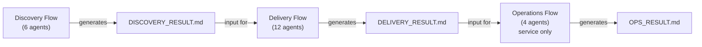

<p align="center">
  
</p>

# Aphelion — Frontier AI Agents

Claude Code 向け AI コーディングエージェント定義集です。27 の専門エージェントがプロジェクトの全工程を自動化します。

[](https://aphelion-agents.pages.dev/)

**[English README](README.md)**

---

## What's Aphelion

Aphelion はソフトウェア開発を3つの領域に分割し、それぞれ独立したフローオーケストレーターが管理します。



各フェーズ完了ごとにユーザーの承認を得てから次へ進みます。`service` 以外（`tool` / `library` / `cli`）は Operations をスキップします。

---

## Why Aphelion

AI コーディングエージェントは強力ですが、単一セッションではプロジェクト全体を扱いきれません。コンテキストウィンドウが溢れ、品質ゲートが省略され、フェーズ間の構造的な引き継ぎがありません。Aphelion はライフサイクルを独立した領域に分割し、専門エージェント・承認ゲート・ドキュメント駆動のハンドオフでこれらの課題を解決します。

---

## Getting Started

### npx でインストール（推奨）

```bash
# プロジェクトに初回配置
npx github:kirin0198/aphelion-agents init

# ユーザーホーム (~/.claude/) に配置
npx github:kirin0198/aphelion-agents init --user

# 最新版に更新
npx github:kirin0198/aphelion-agents update
npx github:kirin0198/aphelion-agents update --user
```

`update` は `agents/`, `rules/`, `commands/`, `orchestrator-rules.md` を上書きします。
`settings.local.json` は既存があれば保護されます。成功時に `source: aphelion-agents@<version>` が出力されるため、どのバージョンを取得したか確認できます。

#### キャッシュに関する注意

`npx` は `name@version` でパッケージをキャッシュします。`version` 文字列が同一の古いキャッシュがローカルに残っている場合、`update` はその古いスナップショットを無言でコピーします。強制的に最新を取得するには:

- ref を `main` に固定する: `npx github:kirin0198/aphelion-agents#main update`
- もしくはキャッシュをクリアする: `npm cache clean --force` 後に `update` を再実行

実行時に表示される `source: aphelion-agents@<version>` を [main の package.json](https://github.com/kirin0198/aphelion-agents/blob/main/package.json) の `version` と突き合わせると、確実に最新が反映されたか判別できます。

### git clone でインストール（代替手順）

リポジトリをクローンして手動でファイルをコピーする方法：

```bash
cp -r .claude /path/to/your-project/
cd /path/to/your-project && claude

/discovery-flow TODOアプリを作りたい
```

フローオーケストレーターがプロジェクト規模を自動判定し、必要なエージェントだけを起動します。

### 利用シナリオ

**新規プロジェクト（フルフロー）** — 要件探索から設計・実装・デプロイまで一気通貫:

```
/discovery-flow ブログ管理システムを作りたい
（Discovery 完了後）
/delivery-flow
（Delivery 完了後、service の場合）
/operations-flow
```

**サクッと作りたい（Delivery のみ）** — 要件が固まっている場合:

```
/pm TODOアプリを作りたい
```

**既存プロジェクトの変更（SPEC / ARCHITECTURE あり）** — バグ修正・機能追加・リファクタリング:

```
/analyst ログイン時に500エラーが発生するバグ
（分析完了後）
/delivery-flow
```

**既存プロジェクトの変更（SPEC / ARCHITECTURE なし）** — まず仕様書・設計書を逆生成:

```
/codebase-analyzer このプロジェクトの仕様と設計を分析して
（分析完了後）
/analyst ログイン機能を追加したい
/delivery-flow
```

### コマンド一覧

| コマンド | 用途 |
|---------|------|
| `/discovery-flow` | 要件探索フローを開始 |
| `/pm` `/delivery-flow` | 設計・実装フローを開始 |
| `/operations-flow` | デプロイ・運用フローを開始 |
| `/analyst` | 既存プロジェクトへの issue 分析 |
| `/codebase-analyzer` | 仕様書のない既存プロジェクトを分析 |

---

## Architecture

### 3領域モデル

各領域は独立セッションで動作し、`.md` ファイルでハンドオフします（自動チェーンなし）。

**Discovery**（要件探索） — interviewer → researcher → poc-engineer → concept-validator → rules-designer → scope-planner

**Delivery**（設計・実装） — spec-designer → ux-designer → architect → scaffolder → developer → test-designer → tester → security-auditor → reviewer → doc-writer → releaser

**Operations**（デプロイ・運用） — infra-builder → db-ops → observability → ops-planner

**スタンドアロン** — analyst（issue 分析）、codebase-analyzer（既存コード分析）

### トリアージシステム

フロー開始時にプロジェクト規模を判定し、4段階のプランから必要なエージェントを自動選択します。

| プラン | Discovery | Delivery | Operations |
|--------|-----------|----------|------------|
| **Minimal** | interviewer のみ | 最小構成（5 agents） | — |
| **Light** | + rules-designer, scope-planner | + reviewer, test-designer | infra + ops-planner |
| **Standard** | + researcher, poc-engineer | + scaffolder, doc-writer | + db-ops |
| **Full** | + concept-validator | + releaser | + observability |

`security-auditor` は全プランで必ず実行されます。`ux-designer` は UI を含むプロジェクトでのみ起動します。

### ファイル構成

```
.claude/                         # Claude Code（正規ソース）
├── rules/*.md                   # 行動ルール + 概要（自動ロード）
│   └── aphelion-overview.md     # Aphelion ワークフロー概要
├── orchestrator-rules.md        # オーケストレーター専用ルール
├── agents/*.md                  # エージェント定義（27ファイル）
└── commands/*.md                # スラッシュコマンド定義
```

> Aphelion は開発時ワークフローであり、CI/CD ランタイムではありません。`infra-builder` が GitHub Actions 等のパイプライン定義を生成します。

---

## ドキュメント

エージェントスキーマ、ルール説明、トリアージロジック、プラットフォーム内部の詳細は **[Wiki](docs/wiki/ja/Home.md)** を参照してください。

| ページ | 説明 |
|-------|-----|
| [はじめに](docs/wiki/ja/Getting-Started.md) | 全プラットフォームのセットアップ、初回実行ウォークスルー、利用シナリオ |
| アーキテクチャ（3ページ） | [ドメインモデル](docs/wiki/ja/Architecture-Domain-Model.md), [プロトコル](docs/wiki/ja/Architecture-Protocols.md), [運用ルール](docs/wiki/ja/Architecture-Operational-Rules.md) — 3ドメインモデル、ハンドオフファイル、AGENT_RESULTプロトコル、ランタイム挙動 |
| [トリアージシステム](docs/wiki/ja/Triage-System.md) | プランティア、エージェント選択ロジック、HAS_UI条件 |
| エージェントリファレンス（5ページ） | [オーケストレーター・横断系](docs/wiki/ja/Agents-Orchestrators.md), [Discovery](docs/wiki/ja/Agents-Discovery.md), [Delivery](docs/wiki/ja/Agents-Delivery.md), [Operations](docs/wiki/ja/Agents-Operations.md), [Maintenance](docs/wiki/ja/Agents-Maintenance.md) — 29エージェント |
| [ルールリファレンス](docs/wiki/ja/Rules-Reference.md) | 全8行動ルール — スコープとインタラクション |
| [コントリビューティング](docs/wiki/ja/Contributing.md) | エージェント追加方法、バイリンガル同期ポリシー、PRチェックリスト |

---

## Features

- **3領域分離** — Discovery / Delivery / Operations を独立セッションで管理し、コンテキスト圧迫を防止
- **トリアージ適応** — プロジェクト規模に応じて Minimal〜Full を自動選択。手動設定不要
- **承認ゲート** — 各フェーズ完了時にユーザー承認を必須化。勝手に先へ進まない
- **セキュリティ必須** — security-auditor は全プランで実行（OWASP Top 10 + 依存脆弱性スキャン）
- **自動差し戻し** — テスト失敗・レビュー指摘時に原因分析後ロールバック（最大3回）
- **セッション中断・再開** — TASK.md による状態管理で途中再開が可能
- **ドキュメント駆動** — 領域間は `.md` ハンドオフでトレーサビリティを確保
- **Claude Code ネイティブ** — Claude Code の Agent tool・サブエージェントオーケストレーション・パーミッションモードに基づいて構築
- **多言語対応** — Python / TypeScript / Go / Rust に対応
- **コンテナ隔離** — infra-builder が devcontainer / docker-compose.dev.yml を生成し、sandbox-runner が auto-permission モードでも実体的なコンテナ隔離を提供

---

## License

MIT
