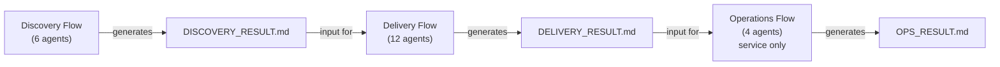

# Aphelion — Frontier AI Agents

A collection of AI coding agent definitions for Claude Code that automates the entire project lifecycle with 27 specialized agents.

[](https://aphelion-agents.pages.dev/)

**[日本語版 README はこちら](README.ja.md)**

---

## What's Aphelion

Aphelion divides software development into three domains, each managed by an independent flow orchestrator:



User approval is required at each phase completion before proceeding. Non-`service` types (`tool` / `library` / `cli`) skip Operations.

---

## Why Aphelion

AI coding agents are powerful, but a single agent session struggles with full project lifecycles — context windows overflow, quality gates get skipped, and there's no structured handoff between phases. Aphelion solves this by splitting the lifecycle into isolated domains with specialized agents, mandatory approval gates, and document-driven handoffs that preserve traceability across sessions.

---

## Getting Started

### Install via npx (recommended)

```bash
# Initial install (into current project)
npx github:kirin0198/aphelion-agents init

# Install into user home (~/.claude/)
npx github:kirin0198/aphelion-agents init --user

# Update to latest
npx github:kirin0198/aphelion-agents update
npx github:kirin0198/aphelion-agents update --user
```

`update` overwrites `agents/`, `rules/`, `commands/`, and `orchestrator-rules.md`.
`settings.local.json` is preserved if it already exists in the target.
On success the command prints `source: aphelion-agents@<version>` so you can verify
which package version sourced the update.

#### Cache caveat

`npx` caches packages by `name@version`. If your local cache already holds an
older extraction at the same version string, `update` will silently copy that
stale snapshot. To force a refresh:

- Pin the source ref: `npx github:kirin0198/aphelion-agents#main update`
- Or clear the cache: `npm cache clean --force`, then re-run `update`

Compare the printed `source: aphelion-agents@<version>` against the latest
`version` in [package.json on `main`](https://github.com/kirin0198/aphelion-agents/blob/main/package.json)
to confirm freshness.

### Install via git clone (alternative)

Clone the repository and copy the files manually:

```bash
cp -r .claude /path/to/your-project/
cd /path/to/your-project && claude

/discovery-flow I want to build a TODO app
```

The flow orchestrator auto-detects project scale and launches only the agents needed.

### Usage Scenarios

**New project (full flow)** — End-to-end from requirements exploration to deployment:

```
/discovery-flow I want to build a blog management system
(after Discovery completes)
/delivery-flow
(after Delivery completes, for services)
/operations-flow
```

**Quick build (Delivery only)** — When requirements are already clear:

```
/pm I want to build a TODO app
```

**Existing project (with SPEC / ARCHITECTURE)** — Bug fixes, features, or refactoring:

```
/analyst There's a 500 error on login
(after analysis completes)
/delivery-flow
```

**Existing project (without SPEC / ARCHITECTURE)** — Reverse-engineer docs first:

```
/codebase-analyzer Analyze this project's spec and design
(after analysis completes)
/analyst I want to add a login feature
/delivery-flow
```

### Command Reference

| Command | Purpose |
|---------|---------|
| `/aphelion-init` | First-run project rules setup (run immediately after `npx aphelion-agents init`) |
| `/aphelion-help` | List all Aphelion slash commands |
| `/discovery-flow` | Start requirements exploration flow |
| `/pm` `/delivery-flow` | Start design & implementation flow |
| `/operations-flow` | Start deploy & operations flow |
| `/analyst` | Analyze issues for existing projects |
| `/codebase-analyzer` | Analyze existing projects without specs |

---

## Architecture

### Three-Domain Model

Each domain runs in an independent session, handing off via `.md` files (no automatic chaining).

**Discovery** (requirements) — interviewer → researcher → poc-engineer → concept-validator → rules-designer → scope-planner

**Delivery** (design & impl) — spec-designer → ux-designer → architect → scaffolder → developer → test-designer → tester → security-auditor → reviewer → doc-writer → releaser

**Operations** (deploy & ops) — infra-builder → db-ops → observability → ops-planner

**Standalone** — analyst (issue analysis), codebase-analyzer (existing code analysis)

### Triage System

At flow start, project scale is assessed and agents are selected from 4 tiers automatically.

| Plan | Discovery | Delivery | Operations |
|--------|-----------|----------|------------|
| **Minimal** | interviewer only | minimal (5 agents) | — |
| **Light** | + rules-designer, scope-planner | + reviewer, test-designer | infra + ops-planner |
| **Standard** | + researcher, poc-engineer | + scaffolder, doc-writer | + db-ops |
| **Full** | + concept-validator | + releaser | + observability |

`security-auditor` runs on all plans. `ux-designer` runs only for projects with UI.

### File Structure

```
.claude/                         # Claude Code (canonical source)
├── rules/*.md                   # Behavioral rules + overview (auto-loaded)
│   └── aphelion-overview.md     # Aphelion workflow overview
├── orchestrator-rules.md        # Orchestrator-specific rules
├── agents/*.md                  # Agent definitions (27 files)
└── commands/*.md                # Slash command definitions
```

> Aphelion is a development-time workflow, not a CI/CD runtime. `infra-builder` generates pipeline definitions for GitHub Actions, etc.

---

## Documentation

For detailed agent schemas, rule explanations, triage logic, and platform internals, see the **[Wiki](docs/wiki/en/Home.md)**.

| Page | Description |
|------|-------------|
| [Getting Started](docs/wiki/en/Getting-Started.md) | Setup for all platforms, first-run walkthrough, usage scenarios |
| Architecture (3 pages) | [Domain Model](docs/wiki/en/Architecture-Domain-Model.md), [Protocols](docs/wiki/en/Architecture-Protocols.md), [Operational Rules](docs/wiki/en/Architecture-Operational-Rules.md) — 3-domain model, handoff files, AGENT_RESULT protocol, runtime rules |
| [Triage System](docs/wiki/en/Triage-System.md) | Plan tiers, agent selection logic, HAS_UI conditions |
| Agents Reference (5 pages) | [Orchestrators & Cross-Cutting](docs/wiki/en/Agents-Orchestrators.md), [Discovery](docs/wiki/en/Agents-Discovery.md), [Delivery](docs/wiki/en/Agents-Delivery.md), [Operations](docs/wiki/en/Agents-Operations.md), [Maintenance](docs/wiki/en/Agents-Maintenance.md) — all 29 agents |
| [Rules Reference](docs/wiki/en/Rules-Reference.md) | All 8 behavioral rules — scope and interactions |
| [Contributing](docs/wiki/en/Contributing.md) | How to add agents, bilingual sync policy, PR checklist |

---

## Features

- **3-domain separation** — Discovery / Delivery / Operations run in independent sessions to prevent context bloat
- **Triage adaptation** — Auto-selects Minimal–Full plan based on project scale; no manual configuration
- **Approval gates** — User approval required at each phase; the agent never runs ahead without consent
- **Security mandatory** — security-auditor runs on all plans (OWASP Top 10 + dependency vulnerability scanning)
- **Auto rollback** — Root cause analysis and rollback on test failures / review findings (up to 3 times)
- **Session resume** — TASK.md state management enables mid-session resume
- **Document-driven** — Domains connected via `.md` handoff files for full traceability
- **Claude Code native** — Built on Claude Code's Agent tool, sub-agent orchestration, and permission modes
- **Multi-language** — Supports Python / TypeScript / Go / Rust
- **Container isolation** — infra-builder generates devcontainer / docker-compose.dev.yml; sandbox-runner provides real container isolation even in auto-permission mode

---

## License

MIT
