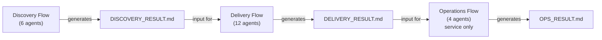

# Aphelion — Frontier AI Agents

A collection of AI coding agent definitions for Claude Code that automates the entire project lifecycle with 39 specialized agents.

[](https://aphelion-agents.com/)

**[日本語版 README はこちら](README.ja.md)**

---

## What's Aphelion

Aphelion divides software development into three domains, each managed by an independent flow orchestrator:



User approval is required at each phase completion before proceeding. Non-`service` types (`tool` / `library` / `cli`) skip Operations.

---

## Why Aphelion

AI coding agents are powerful, but a single agent session struggles with full project lifecycles — context windows overflow, quality gates get skipped, and there's no structured handoff between phases. Aphelion solves this by splitting the lifecycle into isolated domains with specialized agents, mandatory approval gates, and document-driven handoffs that preserve traceability across sessions.

---

## Quick Start

```bash
npx github:kirin0198/aphelion-agents init
cd /path/to/your-project && claude
/aphelion-init
```

For `--user` install, cache troubleshooting, git-clone alternative, and full usage scenarios,
see [Getting Started on the Wiki](docs/wiki/en/Getting-Started.md).

All commands: run `/aphelion-help` after init, or see [Getting Started](docs/wiki/en/Getting-Started.md).

---

## Features

- **3-domain separation** — Discovery / Delivery / Operations run in independent sessions to prevent context bloat
- **Triage adaptation** — Auto-selects Minimal–Full plan based on project scale; no manual configuration
- **Approval gates** — User approval required at each phase; the agent never runs ahead without consent
- **Security mandatory** — `security-auditor` runs on all plans (OWASP Top 10 + dependency vulnerability scanning)
- **Document-driven** — Domains connected via `.md` handoff files for full traceability

---

## Learn more

- **[Wiki Home](docs/wiki/en/Home.md)** ([日本語](docs/wiki/ja/Home.md)) — full reference, persona-based entry points
- [Getting Started](docs/wiki/en/Getting-Started.md) — first-run walkthrough, scenarios, troubleshooting
- [Architecture: Domain Model](docs/wiki/en/Architecture-Domain-Model.md) — 3-domain model & handoff files
- [Triage System](docs/wiki/en/Triage-System.md) — plan tiers & agent selection
- [Agents Reference](docs/wiki/en/Agents-Orchestrators.md) — all 32 agents

---

## License

MIT
