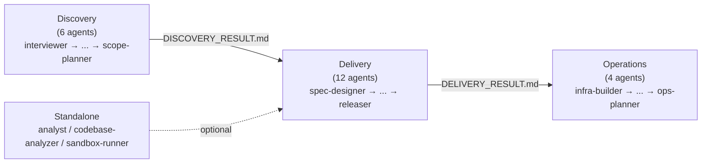

# Wiki Architecture Diagrams — 方針書

> 作成日: 2026-04-18
> Issue 種別: Feature / Documentation Enhancement
> 対応ブランチ: `feat/wiki-architecture-diagrams`
> ハンドオフ先: developer（architect はスキップ）

---

## 1. ユーザー要件

`docs/wiki/en/Architecture.md` および `docs/wiki/ja/Architecture.md` は現在テキスト中心で、一部に ASCII アートによるフロー図が含まれている。読者（エージェント開発者）が Aphelion の 3 ドメインモデル、エージェント連携、トリアージ、ハンドオフ、AGENT_RESULT ライフサイクル、sandbox 防御レイヤーを短時間で把握できるよう、**GitHub Markdown ネイティブで描画可能な図**を Architecture.md に追加したい。

---

## 2. Issue 分類

- **種別**: 機能追加（ドキュメント拡充）
- **ラベル**: `enhancement`, `documentation`
- **対象ドキュメント**: `docs/wiki/en/Architecture.md`, `docs/wiki/ja/Architecture.md`
- **対象ではないドキュメント**: `docs/wiki/*/Agents-Reference.md`, `Rules-Reference.md`, `Triage-System.md` 等（今回はスコープ外）

---

## 3. 決定事項（承認済み）

| 項目 | 決定内容 | 備考 |
|------|----------|------|
| 描画手法 | **Mermaid** | GitHub Markdown がネイティブサポート。画像ファイル生成不要 |
| 図の範囲 | **全 6 図** | 章立ては下記「4. 図の一覧」参照 |
| 多言語方針 | **ラベル英語統一・Mermaid ブロック共有** | en/ja で完全同一の Mermaid ソースを配置し、前後の説明文のみ翻訳する |
| 配置 | **Architecture.md 内インライン** | 別ページ分離はしない。各セクションの冒頭に該当図を埋め込む |

---

## 4. 図の一覧

### 図 1: 3 ドメインモデル全体像

- **配置**: `## Three-Domain Model` セクション冒頭（既存 ASCII ブロックの直前または置き換えなし＝共存）
- **種別**: `flowchart LR`
- **表現内容**:
  - Discovery Flow（6 agents）→ [DISCOVERY_RESULT.md] → Delivery Flow（12 agents）→ [DELIVERY_RESULT.md] → Operations Flow（4 agents）→ [OPS_RESULT.md]
  - ハンドオフファイルをノード形状で強調（rect）
  - Operations Flow は `PRODUCT_TYPE: service` 条件を注記

### 図 2: エージェントフロー

- **配置**: `## Three-Domain Model` セクション末尾もしくは `## Flow Orchestrators` セクション直前
- **種別**: `flowchart TB` + 3 サブグラフ
- **表現内容**:
  - サブグラフ 1: Discovery（6 エージェント）のシーケンス
  - サブグラフ 2: Delivery（12 エージェント）のシーケンス
  - サブグラフ 3: Operations（4 エージェント）のシーケンス
  - 各サブグラフ内のエージェント接続を矢印で表現
  - 正確なエージェント名は `.claude/agents/` 配下を developer が確認して反映

### 図 3: トリアージ 4 ティア比較

- **配置**: Architecture.md に新セクション（`## Triage Tiers`）として追加、または `## Flow Orchestrators` 配下のサブセクション
- **種別**: `flowchart LR` またはテーブル併記の `flowchart`
- **表現内容**:
  - Minimal / Light / Standard / Full の 4 ティア
  - 各ティアに含まれるエージェント数と分岐条件（プロジェクト規模・複雑度）
  - 詳細は `docs/wiki/*/Triage-System.md` に委譲する旨を注記

### 図 4: ハンドオフファイルのデータフロー

- **配置**: `## Handoff File Schema` セクション冒頭
- **種別**: `flowchart LR`
- **表現内容**:
  - DISCOVERY_RESULT.md → DELIVERY_RESULT.md → OPS_RESULT.md のデータフロー
  - 各ファイルの必須フィールド（PRODUCT_TYPE 等）を注記
  - どのエージェントが生成／消費するか矢印のラベルで示す

### 図 5: AGENT_RESULT STATUS ライフサイクル

- **配置**: `## AGENT_RESULT Protocol` セクション冒頭
- **種別**: `stateDiagram-v2`
- **表現内容**:
  - 初期状態 → success / error / failure / blocked / approved / rejected への遷移
  - 各 STATUS から Orchestrator がとるアクション（approval gate / rollback / resume など）を遷移ラベルで表記

### 図 6: sandbox 2 層防御レイヤー

- **配置**: Architecture.md に新セクション（`## Sandbox Defense Layers`）として追加
- **種別**: `flowchart TB` または `graph TD`（2 レイヤーを箱で積む）
- **表現内容**:
  - Advisory layer: `sandbox-policy` + Claude Code permission system
  - Enforcement layer: devcontainer によるコンテナ隔離
  - 詳細は `docs/issues/sandbox-design.md` 及び該当 wiki ページ（もしあれば）にリンク

---

## 5. developer 向けブリーフ

### 配置方針

- 既存 Architecture.md の見出し構造を**壊さない**。各セクションの先頭に Mermaid 図を追加する。
  - 例: 図 1 → `## Three-Domain Model` 冒頭
  - 例: 図 2 → `## Three-Domain Model` 末尾または `## Flow Orchestrators` 直前（見通しが良い方を選択）
  - 例: 図 4 → `## Handoff File Schema` 冒頭
  - 例: 図 5 → `## AGENT_RESULT Protocol` 冒頭
  - 例: 図 3, 図 6 → 新規サブセクションを追加

### ソースコメント

- 各 Mermaid ブロックの直前に以下のコメントを入れること。メンテナンス時に grep で追跡できるようにする。

```markdown
<!-- source: .claude/CLAUDE.md / .claude/orchestrator-rules.md / etc. -->
```mermaid
...
```
```

### en/ja 同期

- en/ja 両方に**完全同一**の Mermaid ブロックを配置する（ラベルは英語統一）
- 図の前後の説明文（キャプション、補足）のみ翻訳する
- 両ファイルの `> **Last updated**: YYYY-MM-DD` を更新する

### 構文制約

- Mermaid 構文は GitHub がサポートする範囲内に限定する:
  - `flowchart` (LR / TB / TD)
  - `stateDiagram-v2`
  - `sequenceDiagram`
- `mindmap`, `timeline`, `gitGraph` 等の新しめの構文は GitHub で描画が不安定なため使用しない

### 既存資産との共存

- 既存の ASCII ダイアグラム（Phase Execution Loop, Three-Domain Model の ASCII 表現, Rollback flows など）は**削除しない**。Mermaid 図と共存させる。
- 既存の Markdown テーブルもそのまま保持する。

### 情報源の正確性

- エージェント名の正確性は `.claude/agents/` 配下のファイル名を参照
- トリアージティアの詳細は `.claude/orchestrator-rules.md` を参照
- ハンドオフファイル必須フィールドは既存の `## Handoff File Schema` 節から取得
- sandbox レイヤーの構成は `docs/issues/sandbox-design.md` を参照

### コミット戦略

- 2 コミット分割（en / ja）または 1 コミット一括は developer の判断に委ねる
- commit prefix は `docs:` を使用
- `git add -A` は禁止。`git add docs/wiki/en/Architecture.md docs/wiki/ja/Architecture.md` のように個別ステージ

---

## 6. スコープ外

- 他 wiki ページ（Agents-Reference, Rules-Reference, Triage-System, Platform-Guide, Contributing, Getting-Started, Home）への図追加
- 画像ファイル（PNG/SVG）の生成とコミット
- 既存 ASCII ダイアグラムの削除・置き換え
- SPEC.md / ARCHITECTURE.md の作成（Aphelion リポジトリでは発生しない）
- PR 作成（本フェーズ完了時点では不要）

---

## 7. 参照

- GitHub Issue: （本方針書作成と同時に `gh issue create` で発行）
- 関連前回成果物: `docs/issues/sandbox.md`, `docs/issues/sandbox-design.md`
- 参照元:
  - `.claude/CLAUDE.md`
  - `.claude/orchestrator-rules.md`
  - `.claude/rules/agent-communication-protocol.md`
  - `docs/wiki/en/Architecture.md`, `docs/wiki/ja/Architecture.md`

---

## Addendum (2026-04-19): Figure 2 Rework

### 理由

図2（Agent Flow）は `flowchart TB` + 4サブグラフ（Discovery 6 / Delivery 12 / Operations 4 / Standalone 3）の構成で縦長になり、ページ全体の可読性を著しく低下させていた。特に Delivery の12エージェントが直列に並ぶ部分が長大で、スクロールせずに全体像を把握することが困難だった。

### 採用案: 案B（ドメイン折りたたみ + Agents-Reference へのリンク）

各ドメインを1つのノードに集約し、ノードをクリックすると `Agents-Reference.md` の該当セクションへジャンプする `click` 構文を使用した。



### 効果

- **ページコンパクト化**: 縦長な4サブグラフ構成を横並びの4ノードに集約
- **情報重複解消**: エージェント名の羅列を Agents-Reference.md へ委譲し、二重管理を排除
- **ナビゲーション改善**: `click` 構文により、ノードから詳細ページへ直接ジャンプ可能

### 変更ファイル

- `docs/wiki/en/Architecture.md` — 図2を新 Mermaid ソースに置き換え
- `docs/wiki/ja/Architecture.md` — 同一 Mermaid ソースを適用（前後の説明文は日本語）
