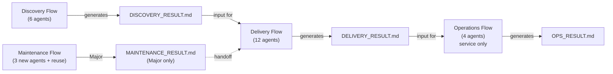
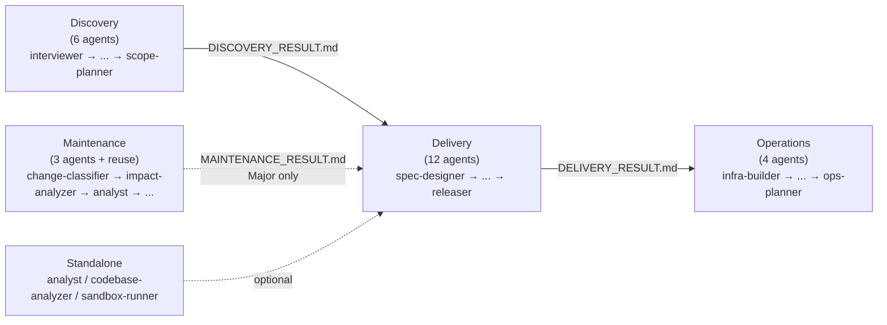

# Architecture: Domain Model

> **Language**: [English](../en/Architecture-Domain-Model.md) | [日本語](../ja/Architecture-Domain-Model.md)
> **Last updated**: 2026-04-25 (split from Architecture.md; #42)
> **Audience**: Agent developers

This page is one of three pages split from the original Architecture.md (#42). It covers Aphelion's conceptual domain model: the three-domain model, session isolation strategy, and PRODUCT_TYPE branching. See the sibling pages for protocols and operational rules: [Protocols](./Architecture-Protocols.md), [Operational Rules](./Architecture-Operational-Rules.md).

## Table of Contents

- [Three-Domain Model](#three-domain-model)
- [Session Isolation](#session-isolation)
- [PRODUCT_TYPE Branching](#product_type-branching)
- [Related Pages](#related-pages)
- [Canonical Sources](#canonical-sources)

---

## Three-Domain Model

Aphelion divides the software development lifecycle into three independent domains:

<!-- source: .claude/rules/aphelion-overview.md -->

**Discovery** explores and structures requirements, producing `DISCOVERY_RESULT.md`.

**Delivery** designs, implements, tests, and reviews, producing `DELIVERY_RESULT.md`.

**Operations** builds infrastructure, database operations, and operations plans, producing `OPS_RESULT.md`. Only runs for `PRODUCT_TYPE: service`.

**Maintenance (fourth flow, independent)** triggers on bugs, CVE alerts, performance regressions, or small feature requests for existing projects. Performs Patch / Minor / Major triage via `change-classifier`. Patch and Minor complete independently; Major generates `MAINTENANCE_RESULT.md` and hands off to Delivery Flow as a pre-processing stage. See [Maintenance Flow Triage](./Triage-System.md#maintenance-flow-triage) for details.

### Design Principles

| Principle | Description |
|-----------|-------------|
| Domain separation | Each domain runs in an independent Claude Code session |
| File handoff | Domains connect through `.md` files, not automatic API calls |
| No automatic chaining | Each domain must be started by the user after reviewing the previous domain's output |
| Triage adaptation | Each flow orchestrator assesses project scale and selects a plan tier |
| Independent invocation | Any agent can be invoked standalone if its input files are available |

### Agent Flow

<!-- source: .claude/agents/ (agent file names), .claude/orchestrator-rules.md -->

Per-domain details:
[Discovery](./Agents-Discovery.md) ·
[Delivery](./Agents-Delivery.md) ·
[Operations](./Agents-Operations.md) ·
[Maintenance](./Agents-Maintenance.md) ·
[Standalone](./Agents-Orchestrators.md#standalone-agents)

Maintenance is a **fourth flow independent from the primary Discovery → Delivery → Operations pipeline**, invoked via `/maintenance-flow` for existing-project maintenance tasks. Patch and Minor plans complete standalone; only Major plans hand off to Delivery via `MAINTENANCE_RESULT.md`. See [Agents Reference → Maintenance](./Agents-Maintenance.md) and [Triage System → Maintenance Flow Triage](./Triage-System.md#maintenance-flow-triage) for full specs.

---

## Session Isolation

Each domain runs in a **separate Claude Code session**. This is a deliberate design choice:

- **Prevents context window overflow**: A full project lifecycle can involve thousands of lines of context. Running everything in one session risks hitting token limits.
- **Enables specialization**: Each orchestrator loads only the rules and agents relevant to its domain.
- **Forces explicit checkpoints**: Users must review each domain's output before launching the next, ensuring quality gates are not skipped.

The four flow orchestrators — `discovery-flow`, `delivery-flow`, `operations-flow`, `maintenance-flow` — are the entry points for each session.

---

## PRODUCT_TYPE Branching

The `PRODUCT_TYPE` field determined during Discovery controls which domains run:

| PRODUCT_TYPE | Discovery | Delivery | Maintenance | Operations |
|-------------|-----------|----------|-------------|------------|
| `service` | Run | Run | Run (as needed) | **Run** |
| `tool` | Run | Run | Run (as needed) | Skip |
| `library` | Run | Run | Run (as needed) | Skip |
| `cli` | Run | Run | Run (as needed) | Skip |

Only `service` products require infrastructure, database operations, and deployment procedures. Maintenance applies to all product types whenever an existing project needs post-release changes.

---

## Related Pages

- [Architecture: Protocols](./Architecture-Protocols.md)
- [Architecture: Operational Rules](./Architecture-Operational-Rules.md)
- [Home](./Home.md)
- [Triage System](./Triage-System.md)
- [Agents Reference: Orchestrators & Cross-Cutting](./Agents-Orchestrators.md)
- [Rules Reference](./Rules-Reference.md)

## Canonical Sources

- [.claude/rules/aphelion-overview.md](../../.claude/rules/aphelion-overview.md) — Workflow model and design principles (auto-loaded)
- [.claude/orchestrator-rules.md](../../.claude/orchestrator-rules.md) — Triage, handoff schema, approval gate, rollback rules
- [.claude/rules/agent-communication-protocol.md](../../.claude/rules/agent-communication-protocol.md) — AGENT_RESULT format and STATUS definitions
