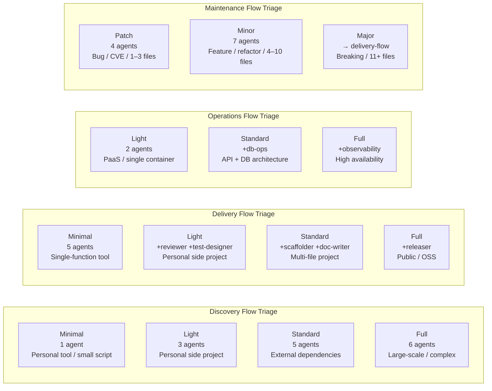
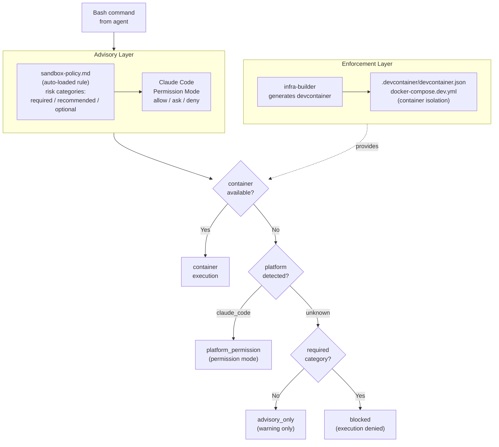

# Architecture: Operational Rules

> **Language**: [English](../en/Architecture-Operational-Rules.md) | [日本語](../ja/Architecture-Operational-Rules.md)
> **Last updated**: 2026-04-25 (updated 2026-04-25: rename docs/issues/ → docs/design-notes/ (#51))
> **Audience**: Agent developers

This page is one of three pages split from the original Architecture.md (#42). It covers runtime and operational behaviors: Auto-Approve Mode, the Phase Execution Loop, Triage Tiers, Rollback Rules, and Sandbox Defense Layers. See the sibling pages for conceptual model and protocols: [Domain Model](./Architecture-Domain-Model.md), [Protocols](./Architecture-Protocols.md).

## Table of Contents

- [Auto-Approve Mode](#auto-approve-mode)
- [Flow Orchestrators](#flow-orchestrators)
- [Triage Tiers](#triage-tiers)
- [Rollback Rules](#rollback-rules)
- [Sandbox Defense Layers](#sandbox-defense-layers)
- [Related Pages](#related-pages)
- [Canonical Sources](#canonical-sources)

---

## Auto-Approve Mode

When a file named `.aphelion-auto-approve` (or the legacy `.telescope-auto-approve`) exists in the project root, approval gates are automatically passed. This is designed for automated evaluation systems (e.g., the Ouroboros evaluator).

The file may optionally contain configuration overrides:

```
# Override triage plan
PLAN: Standard

# Override PRODUCT_TYPE
PRODUCT_TYPE: service

# Override HAS_UI
HAS_UI: true
```

**Safety limits in auto-approve mode:**
- Maximum 3 retries per agent on error
- Maximum 3 rollbacks total

---

## Flow Orchestrators

The three flow orchestrators each manage a domain. They share the following common behavior (defined in `.claude/orchestrator-rules.md`):

1. **Read orchestrator-rules.md** at startup
2. **Perform triage** to select a plan tier
3. **Present triage results** and request user approval (unless AUTO_APPROVE: true)
4. **Launch agents in sequence** using the `Agent` tool with `subagent_type`
5. **Execute approval gate** after each phase (unless AUTO_APPROVE: true)
6. **Handle errors** via `AskUserQuestion` with retry/skip/abort options

### Phase Execution Loop

```
[Phase N start]
  1. Notify user: "▶ Phase N/M: launching {agent}"
  2. Launch agent with preceding artifact paths
  3. Read AGENT_RESULT from agent output
  4. Handle STATUS: error / blocked / failure
  5. If AUTO_APPROVE: true → auto-select "承認して続行"
     If AUTO_APPROVE: false → show approval gate, wait for user
  6. Proceed to Phase N+1
```

---

## Triage Tiers

Each flow orchestrator assesses project characteristics at startup and selects one of four plan tiers. See [Triage System](./Triage-System.md) for full details.

<!-- source: .claude/orchestrator-rules.md (Triage System) -->


> **Note**: `security-auditor` runs on all Delivery plans. `ux-designer` runs only when `HAS_UI: true`.

---

## Rollback Rules

Rollbacks are triggered automatically by test failures and review CRITICAL findings. All rollbacks are limited to **3 times maximum**.

### Test Failure Rollback (Delivery domain)

```
tester (failure)
  → test-designer (root cause analysis)
    → developer (fix implementation)
      → tester (re-run)
```

### Review CRITICAL Rollback (Delivery domain)

```
reviewer (CRITICAL detected)
  → developer (fix)
    → tester (re-run)
      → reviewer (re-review)
```

### Security Audit CRITICAL Rollback (Delivery domain)

```
security-auditor (CRITICAL detected)
  → developer (fix)
    → tester (re-run)
      → security-auditor (re-audit)
```

### Discovery Rollback: Infeasible Requirements

```
poc-engineer (blocked, BLOCKED_ITEMS > 0)
  → interviewer (discuss alternatives with user)
    → researcher (re-investigate if needed)
      → poc-engineer (re-verify)
```

---

## Sandbox Defense Layers

Aphelion uses two complementary layers to protect against dangerous command execution. See [.claude/rules/sandbox-policy.md](../../.claude/rules/sandbox-policy.md) for sandbox-mode configuration details.

<!-- source: docs/design-notes/archived/sandbox-design.md (§1, §2, Addendum §A.2) -->


> **Fallback order**: `container` → `platform_permission` → `advisory_only` → `blocked`

---

## Related Pages

- [Architecture: Domain Model](./Architecture-Domain-Model.md)
- [Architecture: Protocols](./Architecture-Protocols.md)
- [Home](./Home.md)
- [Triage System](./Triage-System.md)
- [Agents Reference: Orchestrators & Cross-Cutting](./Agents-Orchestrators.md)
- [Rules Reference](./Rules-Reference.md)

## Canonical Sources

- [.claude/rules/aphelion-overview.md](../../.claude/rules/aphelion-overview.md) — Workflow model and design principles (auto-loaded)
- [.claude/orchestrator-rules.md](../../.claude/orchestrator-rules.md) — Triage, handoff schema, approval gate, rollback rules
- [.claude/rules/agent-communication-protocol.md](../../.claude/rules/agent-communication-protocol.md) — AGENT_RESULT format and STATUS definitions
