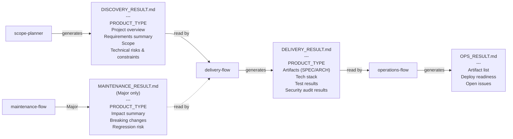
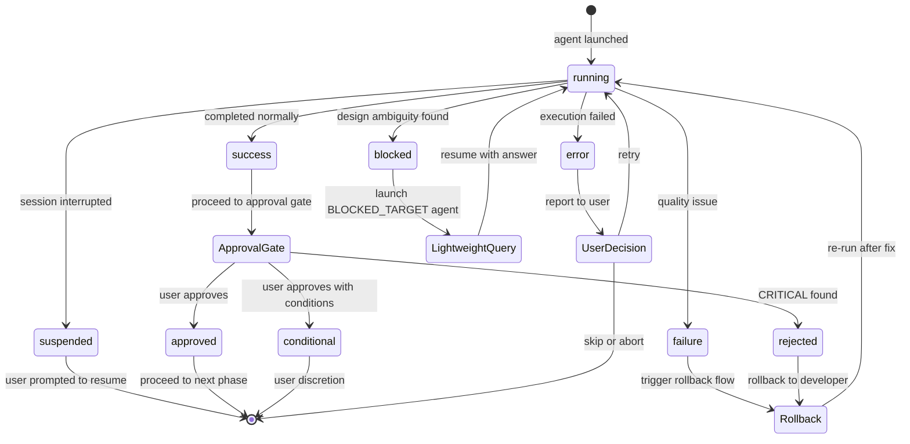

# Architecture: Protocols

> **Language**: [English](../en/Architecture-Protocols.md) | [日本語](../ja/Architecture-Protocols.md)
> **Last updated**: 2026-04-25 (split from Architecture.md; #42)
> **Audience**: Agent developers

This page is one of three pages split from the original Architecture.md (#42). It covers the handoff file schemas and the AGENT_RESULT inter-agent communication protocol, including the `blocked` STATUS. See the sibling pages for the domain model and operational rules: [Domain Model](./Architecture-Domain-Model.md), [Operational Rules](./Architecture-Operational-Rules.md).

## Table of Contents

- [Handoff File Schema](#handoff-file-schema)
- [AGENT_RESULT Protocol](#agent_result-protocol)
- [blocked STATUS](#blocked-status)
- [Related Pages](#related-pages)
- [Canonical Sources](#canonical-sources)

---

## Handoff File Schema

Handoff files are the mechanism by which domains communicate. Each is a structured Markdown document validated by the receiving orchestrator.

<!-- source: .claude/orchestrator-rules.md (Handoff File Specification) -->


### DISCOVERY_RESULT.md

Generated by `scope-planner` (or `discovery-flow` in Minimal plan). Input for `delivery-flow`.

**Required fields:**
- `PRODUCT_TYPE` (one of: service / tool / library / cli)
- "プロジェクト概要" section (must not be empty)
- "要件サマリー" section (must not be empty)

**Structure:**

```markdown
# Discovery Result: {project name}

> 作成日: {YYYY-MM-DD}
> Discovery プラン: {Minimal | Light | Standard | Full}

## プロジェクト概要
## 成果物の性質
PRODUCT_TYPE: {service | tool | library | cli}
## 要件サマリー
## スコープ
## 技術リスク・制約
## 未解決事項
```

### DELIVERY_RESULT.md

Generated by `delivery-flow` after all phases complete. Input for `operations-flow`.

**Required fields:**
- `PRODUCT_TYPE`
- "成果物" section (must include SPEC.md and ARCHITECTURE.md status)
- "技術スタック" section (must not be empty)
- "テスト結果" section
- "セキュリティ監査結果" section

### OPS_RESULT.md

Generated by `ops-planner`. Final artifact of the Operations domain.

**Required fields:**
- "成果物一覧" table
- "デプロイ準備状態" checklist

---

## AGENT_RESULT Protocol

Every agent must emit an `AGENT_RESULT` block upon completion. Flow orchestrators parse this block to determine the next action.

<!-- source: .claude/rules/agent-communication-protocol.md -->


### Block Format

```
AGENT_RESULT: {agent-name}
STATUS: success | error | failure | suspended | blocked | approved | conditional | rejected
...(agent-specific fields)
NEXT: {next-agent-name | done | suspended}
```

### STATUS Definitions

| STATUS | Meaning | Orchestrator Action |
|--------|---------|-------------------|
| `success` | Completed successfully | Proceed to approval gate |
| `error` | Failed to complete | Report to user, ask for decision |
| `failure` | Quality issue (e.g., test failure) | Follow domain rollback rules |
| `suspended` | Session interrupted | Prompt user to resume |
| `blocked` | Design ambiguity discovered | Launch target agent in lightweight mode |
| `approved` | Review approved | Proceed |
| `conditional` | Review approved with conditions | User discretion |
| `rejected` | Review rejected (CRITICAL found) | Rollback to developer |

### NEXT Field

The `NEXT` field tells the orchestrator which agent to launch next. Common values:

- A specific agent name (e.g., `architect`, `developer`)
- `done` — the domain is complete
- `suspended` — the session should be paused

---

## blocked STATUS

`blocked` is used when a `developer` agent discovers a design ambiguity or contradiction that prevents implementation from continuing.

```
AGENT_RESULT: developer
STATUS: blocked
BLOCKED_REASON: Module X and Y in ARCHITECTURE.md have overlapping responsibilities
BLOCKED_TARGET: architect
CURRENT_TASK: TASK-005
NEXT: suspended
```

The flow orchestrator launches the agent named in `BLOCKED_TARGET` in **lightweight mode** (a short prompt that only asks and answers the specific question), then resumes the original agent with the answer.

---

## Related Pages

- [Architecture: Domain Model](./Architecture-Domain-Model.md)
- [Architecture: Operational Rules](./Architecture-Operational-Rules.md)
- [Home](./Home.md)
- [Triage System](./Triage-System.md)
- [Agents Reference: Orchestrators & Cross-Cutting](./Agents-Orchestrators.md)
- [Rules Reference](./Rules-Reference.md)

## Canonical Sources

- [.claude/rules/aphelion-overview.md](../../.claude/rules/aphelion-overview.md) — Workflow model and design principles (auto-loaded)
- [.claude/orchestrator-rules.md](../../.claude/orchestrator-rules.md) — Triage, handoff schema, approval gate, rollback rules
- [.claude/rules/agent-communication-protocol.md](../../.claude/rules/agent-communication-protocol.md) — AGENT_RESULT format and STATUS definitions
