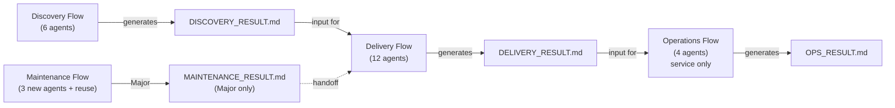
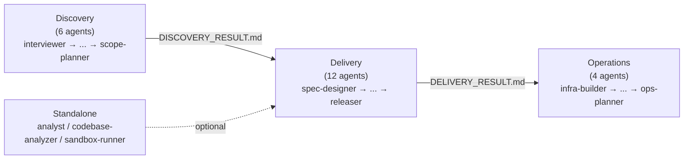
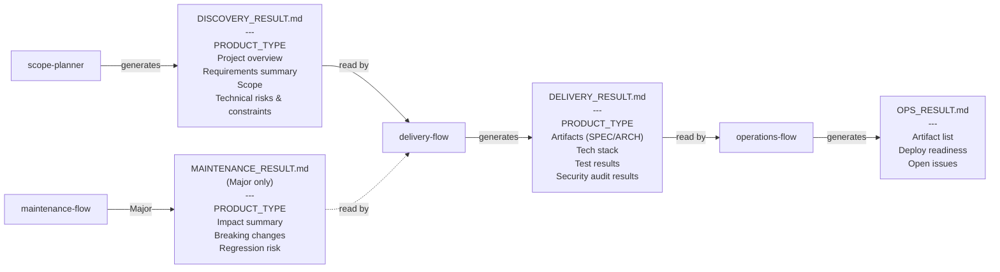
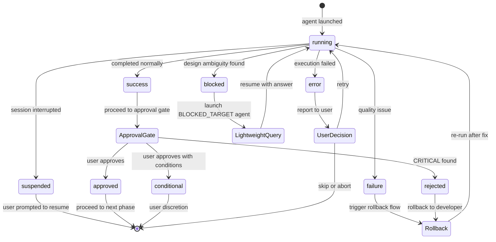
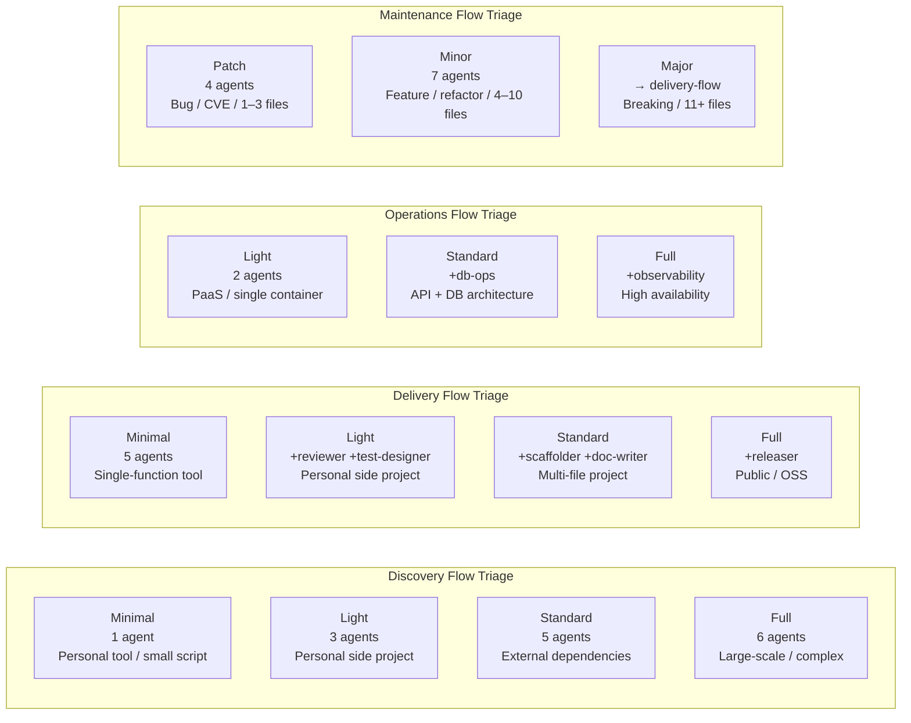
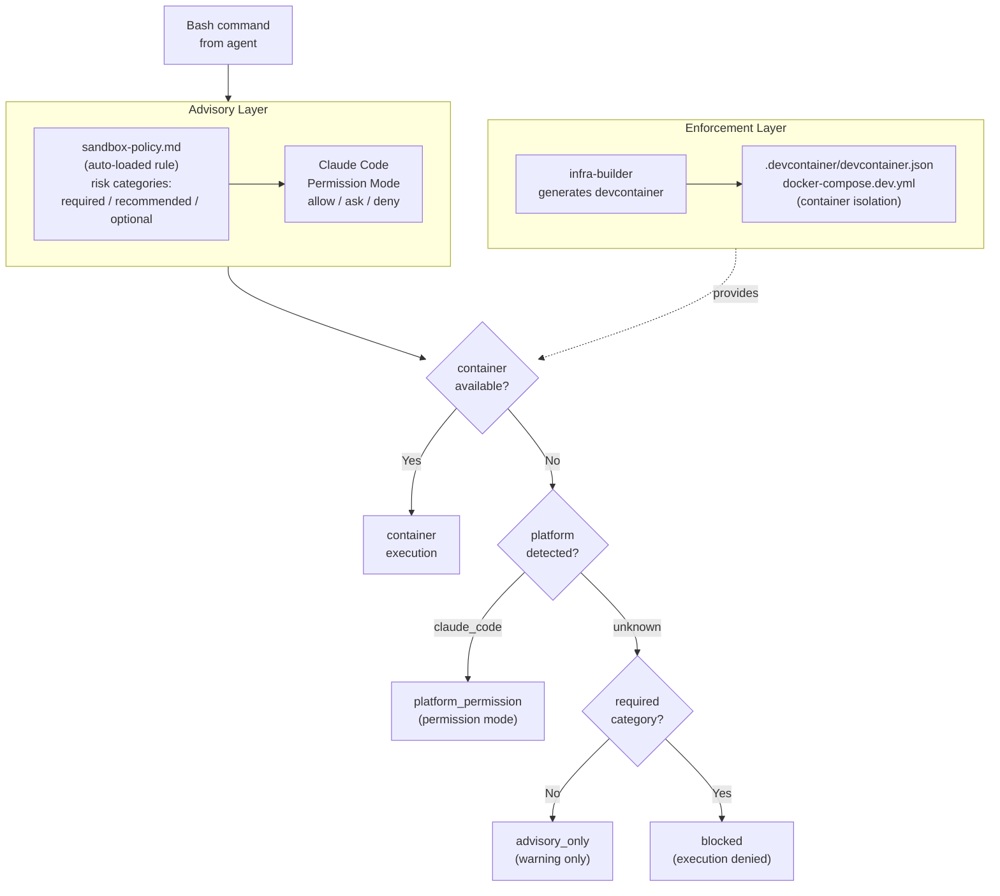

# Architecture

> **Language**: [English](../en/Architecture.md) | [日本語](../ja/Architecture.md)
> **Last updated**: 2026-04-24
> **Audience**: Agent developers

This page describes Aphelion's architectural design: the three-domain model, session isolation strategy, handoff file schemas, PRODUCT_TYPE branching, and the AGENT_RESULT inter-agent communication protocol.

## Table of Contents

- [Three-Domain Model](#three-domain-model)
- [Session Isolation](#session-isolation)
- [Handoff File Schema](#handoff-file-schema)
- [PRODUCT_TYPE Branching](#product_type-branching)
- [AGENT_RESULT Protocol](#agent_result-protocol)
- [blocked STATUS](#blocked-status)
- [Auto-Approve Mode](#auto-approve-mode)
- [Flow Orchestrators](#flow-orchestrators)
- [Triage Tiers](#triage-tiers)
- [Rollback Rules](#rollback-rules)
- [Sandbox Defense Layers](#sandbox-defense-layers)
- [Related Pages](#related-pages)
- [Canonical Sources](#canonical-sources)

---

## Three-Domain Model

Aphelion divides the software development lifecycle into three independent domains:

<!-- source: .claude/rules/aphelion-overview.md -->


**Discovery** explores and structures requirements, producing `DISCOVERY_RESULT.md`.

**Delivery** designs, implements, tests, and reviews, producing `DELIVERY_RESULT.md`.

**Operations** builds infrastructure, database operations, and operations plans, producing `OPS_RESULT.md`. Only runs for `PRODUCT_TYPE: service`.

**Maintenance (fourth flow, independent)** triggers on bugs, CVE alerts, performance regressions, or small feature requests for existing projects. Performs Patch / Minor / Major triage via `change-classifier`. Patch and Minor complete independently; Major generates `MAINTENANCE_RESULT.md` and hands off to Delivery Flow as a pre-processing stage. See [Maintenance Flow Triage](./Triage-System.md#maintenance-flow-triage) for details.

### Design Principles

| Principle | Description |
|-----------|-------------|
| Domain separation | Each domain runs in an independent Claude Code session |
| File handoff | Domains connect through `.md` files, not automatic API calls |
| No automatic chaining | Each domain must be started by the user after reviewing the previous domain's output |
| Triage adaptation | Each flow orchestrator assesses project scale and selects a plan tier |
| Independent invocation | Any agent can be invoked standalone if its input files are available |

### Agent Flow

<!-- source: .claude/agents/ (agent file names), .claude/orchestrator-rules.md -->


Per-domain details:
[Discovery](./Agents-Reference.md#discovery-domain) ·
[Delivery](./Agents-Reference.md#delivery-domain) ·
[Operations](./Agents-Reference.md#operations-domain) ·
[Standalone](./Agents-Reference.md#standalone-agents)

Maintenance-flow agents (change-classifier, impact-analyzer, maintenance-flow) appear under the "Standalone" cluster above because they are invoked independently of the primary 3-domain pipeline. See [Agents Reference → Maintenance](./Agents-Reference.md#maintenance-domain) for their full specs.

---

## Session Isolation

Each domain runs in a **separate Claude Code session**. This is a deliberate design choice:

- **Prevents context window overflow**: A full project lifecycle can involve thousands of lines of context. Running everything in one session risks hitting token limits.
- **Enables specialization**: Each orchestrator loads only the rules and agents relevant to its domain.
- **Forces explicit checkpoints**: Users must review each domain's output before launching the next, ensuring quality gates are not skipped.

The three flow orchestrators — `discovery-flow`, `delivery-flow`, `operations-flow` — are the entry points for each session.

---

## Handoff File Schema

Handoff files are the mechanism by which domains communicate. Each is a structured Markdown document validated by the receiving orchestrator.

<!-- source: .claude/orchestrator-rules.md (Handoff File Specification) -->


### DISCOVERY_RESULT.md

Generated by `scope-planner` (or `discovery-flow` in Minimal plan). Input for `delivery-flow`.

**Required fields:**
- `PRODUCT_TYPE` (one of: service / tool / library / cli)
- "プロジェクト概要" section (must not be empty)
- "要件サマリー" section (must not be empty)

**Structure:**

```markdown
# Discovery Result: {project name}

> 作成日: {YYYY-MM-DD}
> Discovery プラン: {Minimal | Light | Standard | Full}

## プロジェクト概要
## 成果物の性質
PRODUCT_TYPE: {service | tool | library | cli}
## 要件サマリー
## スコープ
## 技術リスク・制約
## 未解決事項
```

### DELIVERY_RESULT.md

Generated by `delivery-flow` after all phases complete. Input for `operations-flow`.

**Required fields:**
- `PRODUCT_TYPE`
- "成果物" section (must include SPEC.md and ARCHITECTURE.md status)
- "技術スタック" section (must not be empty)
- "テスト結果" section
- "セキュリティ監査結果" section

### OPS_RESULT.md

Generated by `ops-planner`. Final artifact of the Operations domain.

**Required fields:**
- "成果物一覧" table
- "デプロイ準備状態" checklist

---

## PRODUCT_TYPE Branching

The `PRODUCT_TYPE` field determined during Discovery controls which domains run:

| PRODUCT_TYPE | Discovery | Delivery | Operations |
|-------------|-----------|----------|------------|
| `service` | Run | Run | **Run** |
| `tool` | Run | Run | Skip |
| `library` | Run | Run | Skip |
| `cli` | Run | Run | Skip |

Only `service` products require infrastructure, database operations, and deployment procedures.

---

## AGENT_RESULT Protocol

Every agent must emit an `AGENT_RESULT` block upon completion. Flow orchestrators parse this block to determine the next action.

<!-- source: .claude/rules/agent-communication-protocol.md -->


### Block Format

```
AGENT_RESULT: {agent-name}
STATUS: success | error | failure | suspended | blocked | approved | conditional | rejected
...(agent-specific fields)
NEXT: {next-agent-name | done | suspended}
```

### STATUS Definitions

| STATUS | Meaning | Orchestrator Action |
|--------|---------|-------------------|
| `success` | Completed successfully | Proceed to approval gate |
| `error` | Failed to complete | Report to user, ask for decision |
| `failure` | Quality issue (e.g., test failure) | Follow domain rollback rules |
| `suspended` | Session interrupted | Prompt user to resume |
| `blocked` | Design ambiguity discovered | Launch target agent in lightweight mode |
| `approved` | Review approved | Proceed |
| `conditional` | Review approved with conditions | User discretion |
| `rejected` | Review rejected (CRITICAL found) | Rollback to developer |

### NEXT Field

The `NEXT` field tells the orchestrator which agent to launch next. Common values:

- A specific agent name (e.g., `architect`, `developer`)
- `done` — the domain is complete
- `suspended` — the session should be paused

---

## blocked STATUS

`blocked` is used when a `developer` agent discovers a design ambiguity or contradiction that prevents implementation from continuing.

```
AGENT_RESULT: developer
STATUS: blocked
BLOCKED_REASON: Module X and Y in ARCHITECTURE.md have overlapping responsibilities
BLOCKED_TARGET: architect
CURRENT_TASK: TASK-005
NEXT: suspended
```

The flow orchestrator launches the agent named in `BLOCKED_TARGET` in **lightweight mode** (a short prompt that only asks and answers the specific question), then resumes the original agent with the answer.

---

## Auto-Approve Mode

When a file named `.aphelion-auto-approve` (or the legacy `.telescope-auto-approve`) exists in the project root, approval gates are automatically passed. This is designed for automated evaluation systems (e.g., the Ouroboros evaluator).

The file may optionally contain configuration overrides:

```
# Override triage plan
PLAN: Standard

# Override PRODUCT_TYPE
PRODUCT_TYPE: service

# Override HAS_UI
HAS_UI: true
```

**Safety limits in auto-approve mode:**
- Maximum 3 retries per agent on error
- Maximum 3 rollbacks total

---

## Flow Orchestrators

The three flow orchestrators each manage a domain. They share the following common behavior (defined in `.claude/orchestrator-rules.md`):

1. **Read orchestrator-rules.md** at startup
2. **Perform triage** to select a plan tier
3. **Present triage results** and request user approval (unless AUTO_APPROVE: true)
4. **Launch agents in sequence** using the `Agent` tool with `subagent_type`
5. **Execute approval gate** after each phase (unless AUTO_APPROVE: true)
6. **Handle errors** via `AskUserQuestion` with retry/skip/abort options

### Phase Execution Loop

```
[Phase N start]
  1. Notify user: "▶ Phase N/M: launching {agent}"
  2. Launch agent with preceding artifact paths
  3. Read AGENT_RESULT from agent output
  4. Handle STATUS: error / blocked / failure
  5. If AUTO_APPROVE: true → auto-select "承認して続行"
     If AUTO_APPROVE: false → show approval gate, wait for user
  6. Proceed to Phase N+1
```

---

## Triage Tiers

Each flow orchestrator assesses project characteristics at startup and selects one of four plan tiers. See [Triage System](./Triage-System.md) for full details.

<!-- source: .claude/orchestrator-rules.md (Triage System) -->


> **Note**: `security-auditor` runs on all Delivery plans. `ux-designer` runs only when `HAS_UI: true`.

---

## Rollback Rules

Rollbacks are triggered automatically by test failures and review CRITICAL findings. All rollbacks are limited to **3 times maximum**.

### Test Failure Rollback (Delivery domain)

```
tester (failure)
  → test-designer (root cause analysis)
    → developer (fix implementation)
      → tester (re-run)
```

### Review CRITICAL Rollback (Delivery domain)

```
reviewer (CRITICAL detected)
  → developer (fix)
    → tester (re-run)
      → reviewer (re-review)
```

### Security Audit CRITICAL Rollback (Delivery domain)

```
security-auditor (CRITICAL detected)
  → developer (fix)
    → tester (re-run)
      → security-auditor (re-audit)
```

### Discovery Rollback: Infeasible Requirements

```
poc-engineer (blocked, BLOCKED_ITEMS > 0)
  → interviewer (discuss alternatives with user)
    → researcher (re-investigate if needed)
      → poc-engineer (re-verify)
```

---

## Sandbox Defense Layers

Aphelion uses two complementary layers to protect against dangerous command execution. See [Platform Guide](./Platform-Guide.md) for per-platform configuration details.

<!-- source: docs/issues/sandbox-design.md (§1, §2, Addendum §A.2) -->


> **Fallback order**: `container` → `platform_permission` → `advisory_only` → `blocked`

---

## Related Pages

- [Home](./Home.md)
- [Triage System](./Triage-System.md)
- [Agents Reference](./Agents-Reference.md)
- [Rules Reference](./Rules-Reference.md)

## Canonical Sources

- [.claude/rules/aphelion-overview.md](../../.claude/rules/aphelion-overview.md) — Workflow model and design principles (auto-loaded)
- [.claude/orchestrator-rules.md](../../.claude/orchestrator-rules.md) — Triage, handoff schema, approval gate, rollback rules
- [.claude/rules/agent-communication-protocol.md](../../.claude/rules/agent-communication-protocol.md) — AGENT_RESULT format and STATUS definitions
