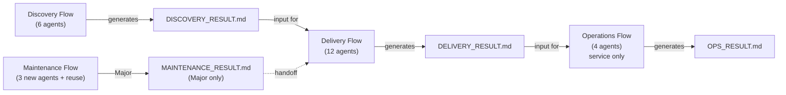
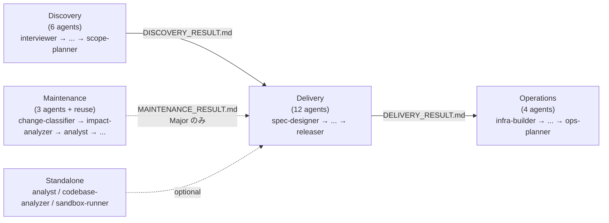

# Architecture: Domain Model

> **Language**: [English](../en/Architecture-Domain-Model.md) | [日本語](../ja/Architecture-Domain-Model.md)
> **Last updated**: 2026-04-25 (updated 2026-04-25: terminology rebalance per #40)
> **EN canonical**: 2026-04-25 of wiki/en/Architecture-Domain-Model.md
> **Audience**: エージェント開発者

このページはもとの Architecture.md を 3 ページに分割したもの（#42）です。Aphelion の概念的ドメインモデル（3ドメインモデル・セッション分離戦略・PRODUCT_TYPE 分岐）を扱います。プロトコルと運用ルールは関連ページを参照してください: [プロトコル](./Architecture-Protocols.md)、[運用ルール](./Architecture-Operational-Rules.md)。

## 目次

- [3ドメインモデル](#3ドメインモデル)
- [セッション分離](#セッション分離)
- [PRODUCT_TYPE分岐](#product_type分岐)
- [関連ページ](#関連ページ)
- [正規ソース](#正規ソース)

---

## 3ドメインモデル

Aphelionはソフトウェア開発ライフサイクルを3つの独立したドメインに分割します：

<!-- source: .claude/rules/aphelion-overview.md -->

**Discovery** は要件を探索・構造化し、`DISCOVERY_RESULT.md` を生成します。

**Delivery** は設計・実装・テスト・レビューを行い、`DELIVERY_RESULT.md` を生成します。

**Operations** はインフラ構築・DB運用・運用計画を行い、`OPS_RESULT.md` を生成します。`PRODUCT_TYPE: service` の場合のみ実行されます。

**Maintenance (独立した第 4 のフロー)** はバグ報告・CVE アラート・パフォーマンス劣化・既存プロジェクトの小規模機能追加を契機に起動します。`change-classifier` によって Patch / Minor / Major をトリアージします。Patch と Minor は単独で完結し、Major は `MAINTENANCE_RESULT.md` を生成して前処理フローとして Delivery Flow に引き渡します。詳細は [Maintenance フローのトリアージ](./Triage-System.md#maintenance-フローのトリアージ) を参照してください。

### 設計原則

| 原則 | 説明 |
|------|------|
| ドメイン分離 | 各ドメインは独立したClaude Codeセッションで実行される |
| ファイルハンドオフ | ドメイン間の接続は自動APIコールではなく `.md` ファイルを通じて行われる |
| 自動チェーンなし | 各ドメインは前ドメインの出力をレビューした後、ユーザーが手動で起動する必要がある |
| トリアージ適応 | 各 Flow Orchestrator（フローオーケストレーター）はプロジェクト規模を評価してプランティアを選択する |
| 独立起動 | 入力ファイルが揃っていれば、どのエージェントも単独で起動できる |

### エージェントフロー

各ドメインのエージェント実行順序を示します。

<!-- source: .claude/agents/ (agent file names), .claude/orchestrator-rules.md -->

ドメインごとの詳細:
[Discovery](./Agents-Discovery.md) ·
[Delivery](./Agents-Delivery.md) ·
[Operations](./Agents-Operations.md) ·
[Maintenance](./Agents-Maintenance.md) ·
[Standalone](./Agents-Orchestrators.md#スタンドアロンエージェント)

Maintenance は **Discovery → Delivery → Operations の主パイプラインから独立した第 4 のフロー**であり、`/maintenance-flow` により既存プロジェクトの保守タスクに対して起動されます。Patch / Minor プランは単独完結し、Major プランのみ `MAINTENANCE_RESULT.md` を介して Delivery に引き渡します。各エージェントの詳細は [エージェントリファレンス → Maintenance](./Agents-Maintenance.md) と [トリアージシステム → Maintenance フローのトリアージ](./Triage-System.md#maintenance-フローのトリアージ) を参照してください。

---

## セッション分離

各ドメインは**独立したClaude Codeセッション**で実行されます。これは意図的な設計上の選択です：

- **コンテキストウィンドウのオーバーフロー防止**: プロジェクト全体のライフサイクルには何千行ものコンテキストが含まれる場合があります。すべてを1つのセッションで実行するとトークン制限に達するリスクがあります。
- **専門化の実現**: 各 Flow Orchestrator は自ドメインに関連するルールとエージェントのみをロードします。
- **明示的なチェックポイントの強制**: ユーザーは次のドメインを起動する前に各ドメインの出力をレビューする必要があり、品質ゲートのスキップを防ぎます。

4 つの Flow Orchestrator（`discovery-flow`、`delivery-flow`、`operations-flow`、`maintenance-flow`）が各セッションのエントリーポイントとなります。

---

## PRODUCT_TYPE分岐

Discoveryフェーズで決定された `PRODUCT_TYPE` フィールドにより、実行されるドメインが決まります：

| PRODUCT_TYPE | Discovery | Delivery | Maintenance | Operations |
|-------------|-----------|----------|-------------|------------|
| `service` | 実行 | 実行 | 実行 (必要時) | **実行** |
| `tool` | 実行 | 実行 | 実行 (必要時) | スキップ |
| `library` | 実行 | 実行 | 実行 (必要時) | スキップ |
| `cli` | 実行 | 実行 | 実行 (必要時) | スキップ |

インフラ・DB運用・デプロイ手順が必要なのは `service` プロダクトのみです。Maintenance はリリース後の変更が必要な場合、全 PRODUCT_TYPE で利用できます。

---

## 関連ページ

- [Architecture: Protocols](./Architecture-Protocols.md)
- [Architecture: Operational Rules](./Architecture-Operational-Rules.md)
- [ホーム](./Home.md)
- [Triage System](./Triage-System.md)
- [Agents Reference: Orchestrators & Cross-Cutting](./Agents-Orchestrators.md)
- [Rules Reference](./Rules-Reference.md)

## 正規ソース

- [.claude/rules/aphelion-overview.md](../../.claude/rules/aphelion-overview.md) — ワークフローモデルと設計原則（自動ロード）
- [.claude/orchestrator-rules.md](../../.claude/orchestrator-rules.md) — トリアージ、ハンドオフスキーマ、承認ゲート、差し戻しルール
- [.claude/rules/agent-communication-protocol.md](../../.claude/rules/agent-communication-protocol.md) — AGENT_RESULT形式とSTATUSの定義
