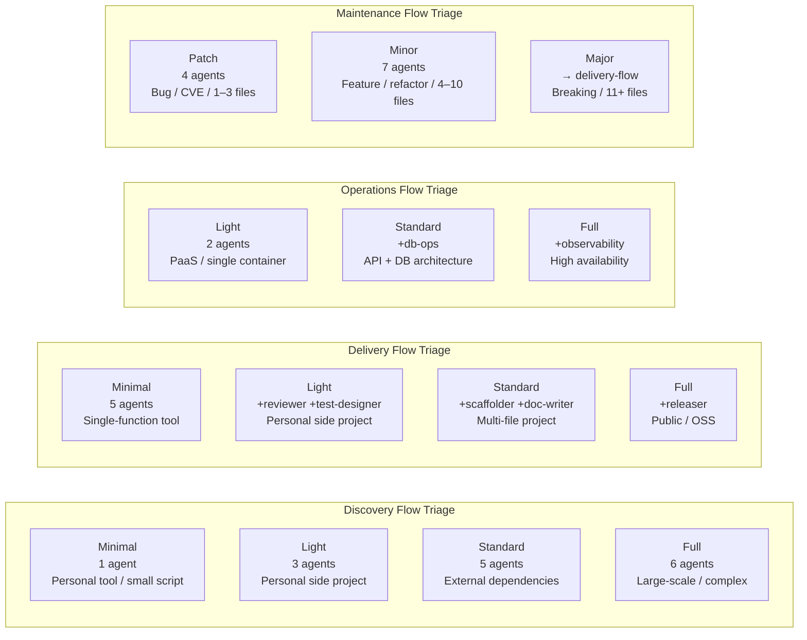
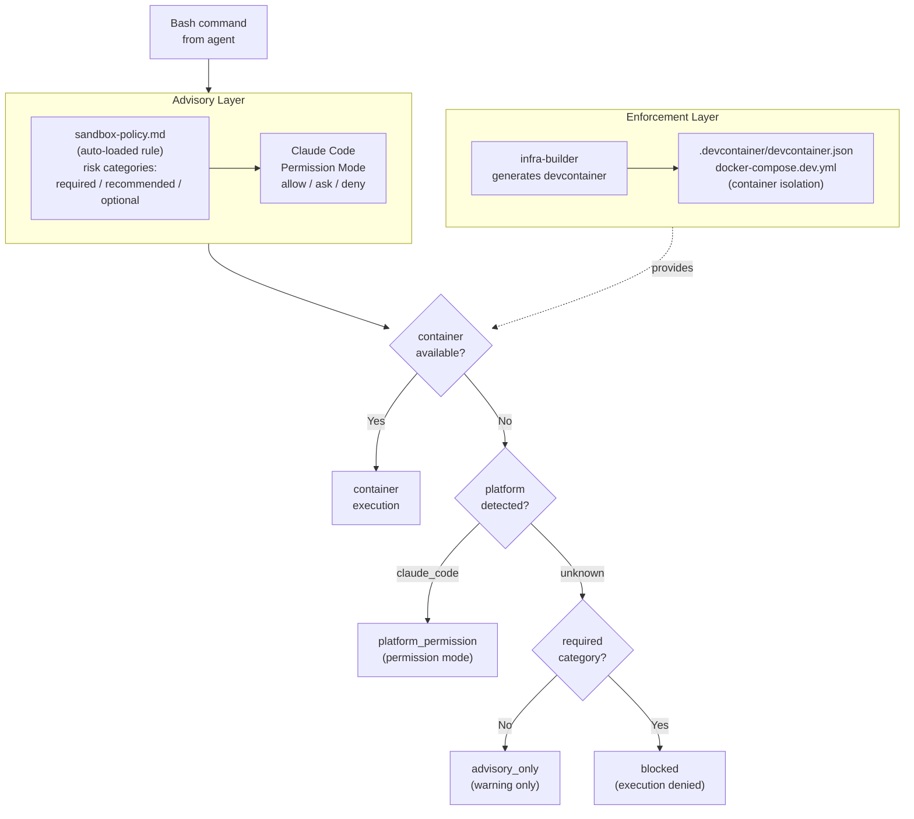

# Architecture: Operational Rules

> **Language**: [English](../en/Architecture-Operational-Rules.md) | [日本語](../ja/Architecture-Operational-Rules.md)
> **Last updated**: 2026-04-25 (updated 2026-04-25: terminology rebalance per #40)
> **EN canonical**: 2026-04-25 of wiki/en/Architecture-Operational-Rules.md
> **Audience**: エージェント開発者

このページはもとの Architecture.md を3ページに分割したもの（#42）です。自動承認モード・フェーズ実行ループ・トリアージティア・差し戻しルール・sandbox防御レイヤーといったランタイム・運用挙動を扱います。概念モデルとプロトコルは関連ページを参照してください: [ドメインモデル](./Architecture-Domain-Model.md)、[プロトコル](./Architecture-Protocols.md)。

## 目次

- [自動承認モード](#自動承認モード)
- [Flow Orchestrator](#flow-orchestrator)
- [トリアージティア](#トリアージティア)
- [差し戻しルール](#差し戻しルール)
- [sandboxの2層防御](#sandboxの2層防御)
- [関連ページ](#関連ページ)
- [正規ソース](#正規ソース)

---

## 自動承認モード

プロジェクトルートに `.aphelion-auto-approve`（またはレガシーの `.telescope-auto-approve`）ファイルが存在する場合、承認ゲートが自動的に通過されます。これは自動評価システム（Ouroborosエバリュエーター等）向けに設計されています。

ファイルにはオプションで設定オーバーライドを含めることができます：

```
# トリアージプランのオーバーライド
PLAN: Standard

# PRODUCT_TYPEのオーバーライド
PRODUCT_TYPE: service

# HAS_UIのオーバーライド
HAS_UI: true
```

**自動承認モードの安全制限：**
- エージェントごとの最大リトライ回数：3回
- ロールバックの最大回数：3回

---

## Flow Orchestrator

Flow Orchestrator（フローオーケストレーター）はそれぞれドメインを管理します。`.claude/orchestrator-rules.md` で定義された以下の共通動作を共有します：

1. 起動時に `orchestrator-rules.md` を読み込む
2. **トリアージ**を実行してプランティアを選択する
3. **トリアージ結果を提示**してユーザーの承認を求める（AUTO_APPROVE: true の場合を除く）
4. `Agent` ツールの `subagent_type` を使用して**順次エージェントを起動**する
5. 各フェーズ後に**承認ゲート**を実行する（AUTO_APPROVE: true の場合を除く）
6. `AskUserQuestion` を使用してリトライ・スキップ・中断のオプションで**エラーを処理**する

### フェーズ実行ループ

```
[フェーズN開始]
  1. ユーザーへ通知：「▶ Phase N/M: {エージェント}を起動します」
  2. 前段成果物のパスを含む指示でエージェントを起動する
  3. エージェント出力からAGENT_RESULTを読み取る
  4. STATUS: error / blocked / failureに対処する
  5. AUTO_APPROVE: true → 「承認して続行」を自動選択
     AUTO_APPROVE: false → 承認ゲートを表示し、ユーザーを待つ
  6. フェーズN+1へ進む
```

---

## トリアージティア

各 Flow Orchestrator は起動時にプロジェクトの特性を評価し、4段階のプランティアのいずれかを選択します。詳細は [Triage System](./Triage-System.md) を参照してください。

<!-- source: .claude/orchestrator-rules.md (Triage System) -->


> **注意**: `security-auditor` は全Deliveryプランで実行されます。`ux-designer` は `HAS_UI: true` の場合のみ実行されます。

---

## 差し戻しルール

差し戻しはテスト失敗とレビューのCRITICAL指摘によって自動的にトリガーされます。すべての差し戻しは**最大3回**までに制限されます。

### テスト失敗による差し戻し（Deliveryドメイン）

```
tester（失敗）
  → test-designer（原因分析）
    → developer（修正実装）
      → tester（再実行）
```

### レビューCRITICALによる差し戻し（Deliveryドメイン）

```
reviewer（CRITICAL検知）
  → developer（修正）
    → tester（再実行）
      → reviewer（再レビュー）
```

### セキュリティ監査CRITICALによる差し戻し（Deliveryドメイン）

```
security-auditor（CRITICAL検知）
  → developer（修正）
    → tester（再実行）
      → security-auditor（再監査）
```

### Discoveryの差し戻し：実現不可能な要件

```
poc-engineer（blocked、BLOCKED_ITEMS > 0）
  → interviewer（ユーザーと代替案を協議）
    → researcher（必要に応じて再調査）
      → poc-engineer（再検証）
```

---

## sandboxの2層防御

Aphelionは危険なコマンド実行を防ぐために2つの相補的なレイヤーを使用します。sandbox モードの設定詳細は [.claude/rules/sandbox-policy.md](../../.claude/rules/sandbox-policy.md) を参照してください。

<!-- source: docs/issues/sandbox-design.md (§1, §2, Addendum §A.2) -->


> **フォールバック順**: `container` → `platform_permission` → `advisory_only` → `blocked`

---

## 関連ページ

- [Architecture: Domain Model](./Architecture-Domain-Model.md)
- [Architecture: Protocols](./Architecture-Protocols.md)
- [ホーム](./Home.md)
- [Triage System](./Triage-System.md)
- [Agents Reference: Orchestrators & Cross-Cutting](./Agents-Orchestrators.md)
- [Rules Reference](./Rules-Reference.md)

## 正規ソース

- [.claude/rules/aphelion-overview.md](../../.claude/rules/aphelion-overview.md) — ワークフローモデルと設計原則（自動ロード）
- [.claude/orchestrator-rules.md](../../.claude/orchestrator-rules.md) — トリアージ、ハンドオフスキーマ、承認ゲート、差し戻しルール
- [.claude/rules/agent-communication-protocol.md](../../.claude/rules/agent-communication-protocol.md) — AGENT_RESULT形式とSTATUSの定義
