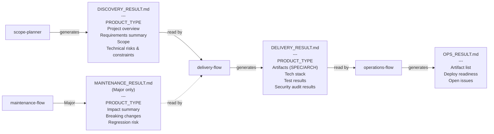
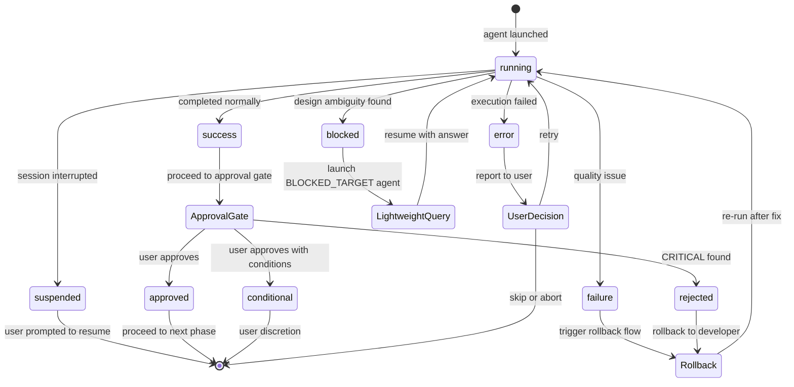

# Architecture: Protocols

> **Language**: [English](../en/Architecture-Protocols.md) | [日本語](../ja/Architecture-Protocols.md)
> **Last updated**: 2026-04-25 (updated 2026-04-25: terminology rebalance per #40)
> **EN canonical**: 2026-04-25 of wiki/en/Architecture-Protocols.md
> **Audience**: エージェント開発者

このページはもとの Architecture.md を3ページに分割したもの（#42）です。ハンドオフファイルスキーマとエージェント間通信プロトコル（AGENT_RESULT）、`blocked` STATUSを扱います。ドメインモデルと運用ルールは関連ページを参照してください: [ドメインモデル](./Architecture-Domain-Model.md)、[運用ルール](./Architecture-Operational-Rules.md)。

## 目次

- [ハンドオフファイルスキーマ](#ハンドオフファイルスキーマ)
- [AGENT_RESULT プロトコル](#agent_result-プロトコル)
- [blocked STATUS](#blocked-status)
- [関連ページ](#関連ページ)
- [正規ソース](#正規ソース)

---

## ハンドオフファイルスキーマ

ハンドオフファイルはドメイン間の通信メカニズムです。各ファイルは受信側の Flow Orchestrator（フローオーケストレーター）が検証する構造化された Markdown ドキュメントです。

各ファイルの必須フィールドと生成・消費の関係を以下に示します。

<!-- source: .claude/orchestrator-rules.md (Handoff File Specification) -->


### DISCOVERY_RESULT.md

`scope-planner`（Minimalプランでは `discovery-flow`）が生成します。`delivery-flow` への入力となります。

**必須フィールド：**
- `PRODUCT_TYPE`（service / tool / library / cli のいずれか）
- 「プロジェクト概要」セクション（空でないこと）
- 「要件サマリー」セクション（空でないこと）

**構造：**

```markdown
# Discovery Result: {プロジェクト名}

> 作成日: {YYYY-MM-DD}
> Discovery プラン: {Minimal | Light | Standard | Full}

## プロジェクト概要
## 成果物の性質
PRODUCT_TYPE: {service | tool | library | cli}
## 要件サマリー
## スコープ
## 技術リスク・制約
## 未解決事項
```

### DELIVERY_RESULT.md

全フェーズ完了後に `delivery-flow` が生成します。`operations-flow` への入力となります。

**必須フィールド：**
- `PRODUCT_TYPE`
- 「成果物」セクション（SPEC.mdとARCHITECTURE.mdのステータスを含むこと）
- 「技術スタック」セクション（空でないこと）
- 「テスト結果」セクション
- 「セキュリティ監査結果」セクション

### OPS_RESULT.md

`ops-planner` が生成します。Operationsドメインの最終成果物です。

**必須フィールド：**
- 「成果物一覧」テーブル
- 「デプロイ準備状態」チェックリスト

---

## AGENT_RESULT プロトコル

すべてのエージェントは完了時に `AGENT_RESULT` ブロックを出力する必要があります。Flow Orchestrator はこのブロックを解析して次のアクションを決定します。

各 STATUS の遷移と Flow Orchestrator の対応アクションを以下に示します。

<!-- source: .claude/rules/agent-communication-protocol.md -->


### ブロック形式

```
AGENT_RESULT: {エージェント名}
STATUS: success | error | failure | suspended | blocked | approved | conditional | rejected
...(エージェント固有フィールド)
NEXT: {次のエージェント名 | done | suspended}
```

### STATUSの定義

| STATUS | 意味 | Flow Orchestrator のアクション |
|--------|------|--------------------------|
| `success` | 正常完了 | 承認ゲートに進む |
| `error` | エラーにより完了失敗 | ユーザーに報告し判断を求める |
| `failure` | 品質問題（テスト失敗等） | ドメインの差し戻しルールに従う |
| `suspended` | セッション中断 | ユーザーに再開を促す |
| `blocked` | 設計上の曖昧さを発見 | 対象エージェントをライトウェイトモードで起動 |
| `approved` | レビュー承認 | 続行 |
| `conditional` | 条件付き承認 | ユーザーの判断に委ねる |
| `rejected` | レビュー却下（CRITICAL発見） | developerに差し戻し |

### NEXTフィールド

`NEXT` フィールドは Flow Orchestrator に次に起動するエージェントを伝えます。主な値：

- 特定のエージェント名（例：`architect`、`developer`）
- `done` — ドメインが完了
- `suspended` — セッションを一時停止する

---

## blocked STATUS

`blocked` は `developer` エージェントが実装を続行できない設計上の曖昧さや矛盾を発見した際に使用されます。

```
AGENT_RESULT: developer
STATUS: blocked
BLOCKED_REASON: ARCHITECTURE.mdのモジュールXとYの責務が重複しており、メソッドZの配置先が不明
BLOCKED_TARGET: architect
CURRENT_TASK: TASK-005
NEXT: suspended
```

Flow Orchestrator は `BLOCKED_TARGET` に指定されたエージェントを**ライトウェイトモード**（特定の質問に答えるだけの短いプロンプト）で起動し、回答を得た後に元のエージェントを再開します。

---

## 関連ページ

- [Architecture: Domain Model](./Architecture-Domain-Model.md)
- [Architecture: Operational Rules](./Architecture-Operational-Rules.md)
- [ホーム](./Home.md)
- [Triage System](./Triage-System.md)
- [Agents Reference: Orchestrators & Cross-Cutting](./Agents-Orchestrators.md)
- [Rules Reference](./Rules-Reference.md)

## 正規ソース

- [.claude/rules/aphelion-overview.md](../../.claude/rules/aphelion-overview.md) — ワークフローモデルと設計原則（自動ロード）
- [.claude/orchestrator-rules.md](../../.claude/orchestrator-rules.md) — トリアージ、ハンドオフスキーマ、承認ゲート、差し戻しルール
- [.claude/rules/agent-communication-protocol.md](../../.claude/rules/agent-communication-protocol.md) — AGENT_RESULT形式とSTATUSの定義
