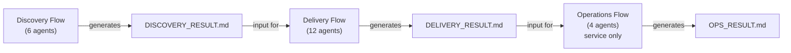
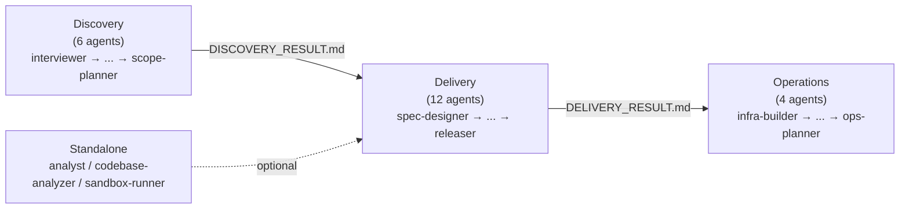
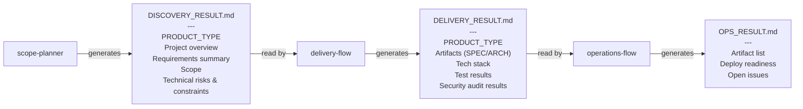
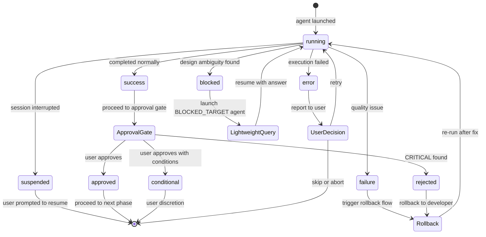
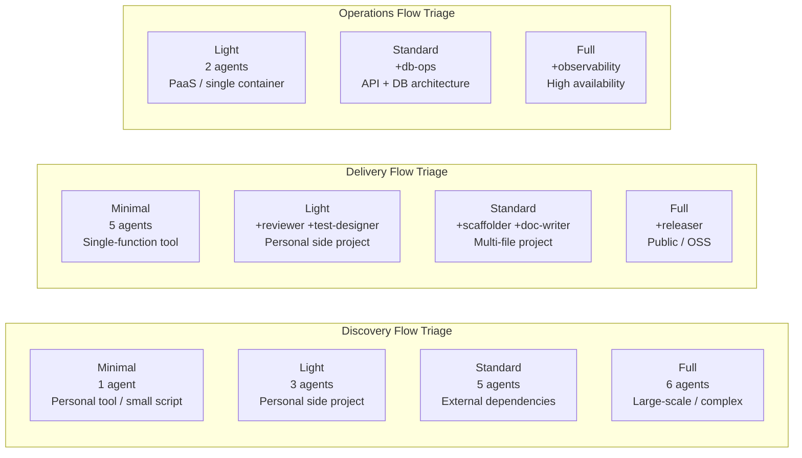
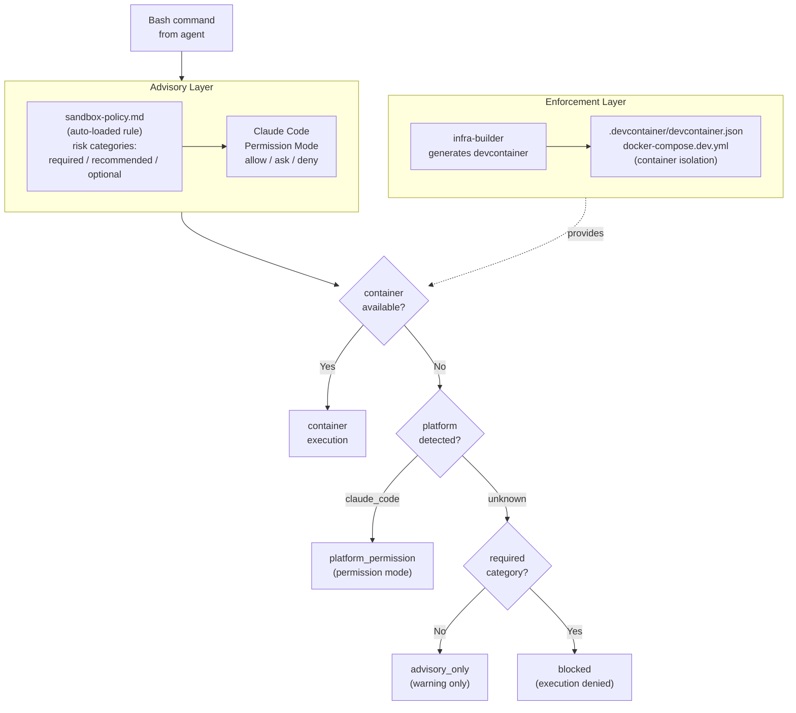

# アーキテクチャ

> **Language**: [English](../en/Architecture.md) | [日本語](../ja/Architecture.md)
> **Last updated**: 2026-04-19
> **EN canonical**: 2026-04-19 of wiki/en/Architecture.md
> **Audience**: エージェント開発者

このページではAphelionのアーキテクチャ設計を説明します：3ドメインモデル、セッション分離戦略、ハンドオフファイルスキーマ、PRODUCT_TYPE分岐、エージェント間通信プロトコル（AGENT_RESULT）について解説します。

## 目次

- [3ドメインモデル](#3ドメインモデル)
- [セッション分離](#セッション分離)
- [ハンドオフファイルスキーマ](#ハンドオフファイルスキーマ)
- [PRODUCT_TYPE分岐](#product_type分岐)
- [AGENT_RESULTプロトコル](#agent_resultプロトコル)
- [blocked STATUS](#blocked-status)
- [自動承認モード](#自動承認モード)
- [フローオーケストレーター](#フローオーケストレーター)
- [トリアージティア](#トリアージティア)
- [差し戻しルール](#差し戻しルール)
- [sandboxの2層防御](#sandboxの2層防御)
- [関連ページ](#関連ページ)
- [正規ソース](#正規ソース)

---

## 3ドメインモデル

Aphelionはソフトウェア開発ライフサイクルを3つの独立したドメインに分割します：

<!-- source: .claude/CLAUDE.md -->


```
Discovery Flow ──[DISCOVERY_RESULT.md]──▶ Delivery Flow ──[DELIVERY_RESULT.md]──▶ Operations Flow
 (要件探索)                              (設計・実装)                            (デプロイ・運用)
 6 agents                                12 agents                               4 agents
```

**Discovery** は要件を探索・構造化し、`DISCOVERY_RESULT.md` を生成します。

**Delivery** は設計・実装・テスト・レビューを行い、`DELIVERY_RESULT.md` を生成します。

**Operations** はインフラ構築・DB運用・運用計画を行い、`OPS_RESULT.md` を生成します。`PRODUCT_TYPE: service` の場合のみ実行されます。

### 設計原則

| 原則 | 説明 |
|------|------|
| ドメイン分離 | 各ドメインは独立したClaude Codeセッションで実行される |
| ファイルハンドオフ | ドメイン間の接続は自動APIコールではなく `.md` ファイルを通じて行われる |
| 自動チェーンなし | 各ドメインは前ドメインの出力をレビューした後、ユーザーが手動で起動する必要がある |
| トリアージ適応 | 各フローオーケストレーターはプロジェクト規模を評価してプランティアを選択する |
| 独立起動 | 入力ファイルが揃っていれば、どのエージェントも単独で起動できる |

### エージェントフロー

各ドメインのエージェント実行順序を示します。

<!-- source: .claude/agents/ (agent file names), .claude/orchestrator-rules.md -->


ドメインごとの詳細:
[Discovery](./Agents-Reference.md#discovery-domain) ·
[Delivery](./Agents-Reference.md#delivery-domain) ·
[Operations](./Agents-Reference.md#operations-domain) ·
[Standalone](./Agents-Reference.md#standalone-agents)

---

## セッション分離

各ドメインは**独立したClaude Codeセッション**で実行されます。これは意図的な設計上の選択です：

- **コンテキストウィンドウのオーバーフロー防止**: プロジェクト全体のライフサイクルには何千行ものコンテキストが含まれる場合があります。すべてを1つのセッションで実行するとトークン制限に達するリスクがあります。
- **専門化の実現**: 各オーケストレーターは自ドメインに関連するルールとエージェントのみをロードします。
- **明示的なチェックポイントの強制**: ユーザーは次のドメインを起動する前に各ドメインの出力をレビューする必要があり、品質ゲートのスキップを防ぎます。

3つのフローオーケストレーター（`discovery-flow`、`delivery-flow`、`operations-flow`）が各セッションのエントリーポイントとなります。

---

## ハンドオフファイルスキーマ

ハンドオフファイルはドメイン間の通信メカニズムです。各ファイルは受信側オーケストレーターが検証する構造化されたMarkdownドキュメントです。

各ファイルの必須フィールドと生成・消費の関係を以下に示します。

<!-- source: .claude/orchestrator-rules.md (Handoff File Specification) -->


### DISCOVERY_RESULT.md

`scope-planner`（Minimalプランでは `discovery-flow`）が生成します。`delivery-flow` への入力となります。

**必須フィールド：**
- `PRODUCT_TYPE`（service / tool / library / cli のいずれか）
- 「プロジェクト概要」セクション（空でないこと）
- 「要件サマリー」セクション（空でないこと）

**構造：**

```markdown
# Discovery Result: {プロジェクト名}

> 作成日: {YYYY-MM-DD}
> Discovery プラン: {Minimal | Light | Standard | Full}

## プロジェクト概要
## 成果物の性質
PRODUCT_TYPE: {service | tool | library | cli}
## 要件サマリー
## スコープ
## 技術リスク・制約
## 未解決事項
```

### DELIVERY_RESULT.md

全フェーズ完了後に `delivery-flow` が生成します。`operations-flow` への入力となります。

**必須フィールド：**
- `PRODUCT_TYPE`
- 「成果物」セクション（SPEC.mdとARCHITECTURE.mdのステータスを含むこと）
- 「技術スタック」セクション（空でないこと）
- 「テスト結果」セクション
- 「セキュリティ監査結果」セクション

### OPS_RESULT.md

`ops-planner` が生成します。Operationsドメインの最終成果物です。

**必須フィールド：**
- 「成果物一覧」テーブル
- 「デプロイ準備状態」チェックリスト

---

## PRODUCT_TYPE分岐

Discoveryフェーズで決定された `PRODUCT_TYPE` フィールドにより、実行されるドメインが決まります：

| PRODUCT_TYPE | Discovery | Delivery | Operations |
|-------------|-----------|----------|------------|
| `service` | 実行 | 実行 | **実行** |
| `tool` | 実行 | 実行 | スキップ |
| `library` | 実行 | 実行 | スキップ |
| `cli` | 実行 | 実行 | スキップ |

インフラ・DB運用・デプロイ手順が必要なのは `service` プロダクトのみです。

---

## AGENT_RESULTプロトコル

すべてのエージェントは完了時に `AGENT_RESULT` ブロックを出力する必要があります。フローオーケストレーターはこのブロックを解析して次のアクションを決定します。

各STATUSの遷移とオーケストレーターの対応アクションを以下に示します。

<!-- source: .claude/rules/agent-communication-protocol.md -->


### ブロック形式

```
AGENT_RESULT: {エージェント名}
STATUS: success | error | failure | suspended | blocked | approved | conditional | rejected
...(エージェント固有フィールド)
NEXT: {次のエージェント名 | done | suspended}
```

### STATUSの定義

| STATUS | 意味 | オーケストレーターのアクション |
|--------|------|--------------------------|
| `success` | 正常完了 | 承認ゲートに進む |
| `error` | エラーにより完了失敗 | ユーザーに報告し判断を求める |
| `failure` | 品質問題（テスト失敗等） | ドメインの差し戻しルールに従う |
| `suspended` | セッション中断 | ユーザーに再開を促す |
| `blocked` | 設計上の曖昧さを発見 | 対象エージェントをライトウェイトモードで起動 |
| `approved` | レビュー承認 | 続行 |
| `conditional` | 条件付き承認 | ユーザーの判断に委ねる |
| `rejected` | レビュー却下（CRITICAL発見） | developerに差し戻し |

### NEXTフィールド

`NEXT` フィールドはオーケストレーターに次に起動するエージェントを伝えます。主な値：

- 特定のエージェント名（例：`architect`、`developer`）
- `done` — ドメインが完了
- `suspended` — セッションを一時停止する

---

## blocked STATUS

`blocked` は `developer` エージェントが実装を続行できない設計上の曖昧さや矛盾を発見した際に使用されます。

```
AGENT_RESULT: developer
STATUS: blocked
BLOCKED_REASON: ARCHITECTURE.mdのモジュールXとYの責務が重複しており、メソッドZの配置先が不明
BLOCKED_TARGET: architect
CURRENT_TASK: TASK-005
NEXT: suspended
```

フローオーケストレーターは `BLOCKED_TARGET` に指定されたエージェントを**ライトウェイトモード**（特定の質問に答えるだけの短いプロンプト）で起動し、回答を得た後に元のエージェントを再開します。

---

## 自動承認モード

プロジェクトルートに `.aphelion-auto-approve`（またはレガシーの `.telescope-auto-approve`）ファイルが存在する場合、承認ゲートが自動的に通過されます。これは自動評価システム（Ouroborosエバリュエーター等）向けに設計されています。

ファイルにはオプションで設定オーバーライドを含めることができます：

```
# トリアージプランのオーバーライド
PLAN: Standard

# PRODUCT_TYPEのオーバーライド
PRODUCT_TYPE: service

# HAS_UIのオーバーライド
HAS_UI: true
```

**自動承認モードの安全制限：**
- エージェントごとの最大リトライ回数：3回
- ロールバックの最大回数：3回

---

## フローオーケストレーター

3つのフローオーケストレーターはそれぞれドメインを管理します。`.claude/orchestrator-rules.md` で定義された以下の共通動作を共有します：

1. 起動時に `orchestrator-rules.md` を読み込む
2. **トリアージ**を実行してプランティアを選択する
3. **トリアージ結果を提示**してユーザーの承認を求める（AUTO_APPROVE: true の場合を除く）
4. `Agent` ツールの `subagent_type` を使用して**順次エージェントを起動**する
5. 各フェーズ後に**承認ゲート**を実行する（AUTO_APPROVE: true の場合を除く）
6. `AskUserQuestion` を使用してリトライ・スキップ・中断のオプションで**エラーを処理**する

### フェーズ実行ループ

```
[フェーズN開始]
  1. ユーザーへ通知：「▶ Phase N/M: {エージェント}を起動します」
  2. 前段成果物のパスを含む指示でエージェントを起動する
  3. エージェント出力からAGENT_RESULTを読み取る
  4. STATUS: error / blocked / failureに対処する
  5. AUTO_APPROVE: true → 「承認して続行」を自動選択
     AUTO_APPROVE: false → 承認ゲートを表示し、ユーザーを待つ
  6. フェーズN+1へ進む
```

---

## トリアージティア

各フローオーケストレーターは起動時にプロジェクトの特性を評価し、4段階のプランティアのいずれかを選択します。詳細は[トリアージシステム](./Triage-System.md)を参照してください。

<!-- source: .claude/orchestrator-rules.md (Triage System) -->


> **注意**: `security-auditor` は全Deliveryプランで実行されます。`ux-designer` は `HAS_UI: true` の場合のみ実行されます。

---

## 差し戻しルール

差し戻しはテスト失敗とレビューのCRITICAL指摘によって自動的にトリガーされます。すべての差し戻しは**最大3回**までに制限されます。

### テスト失敗による差し戻し（Deliveryドメイン）

```
tester（失敗）
  → test-designer（原因分析）
    → developer（修正実装）
      → tester（再実行）
```

### レビューCRITICALによる差し戻し（Deliveryドメイン）

```
reviewer（CRITICAL検知）
  → developer（修正）
    → tester（再実行）
      → reviewer（再レビュー）
```

### セキュリティ監査CRITICALによる差し戻し（Deliveryドメイン）

```
security-auditor（CRITICAL検知）
  → developer（修正）
    → tester（再実行）
      → security-auditor（再監査）
```

### Discoveryの差し戻し：実現不可能な要件

```
poc-engineer（blocked、BLOCKED_ITEMS > 0）
  → interviewer（ユーザーと代替案を協議）
    → researcher（必要に応じて再調査）
      → poc-engineer（再検証）
```

---

## sandboxの2層防御

Aphelionは危険なコマンド実行を防ぐために2つの相補的なレイヤーを使用します。プラットフォームごとの設定詳細は[プラットフォームガイド](./Platform-Guide.md)を参照してください。

<!-- source: docs/issues/sandbox-design.md (§1, §2, Addendum §A.2) -->


> **フォールバック順**: `container` → `platform_permission` → `advisory_only` → `blocked`

---

## 関連ページ

- [ホーム](./Home.md)
- [トリアージシステム](./Triage-System.md)
- [エージェントリファレンス](./Agents-Reference.md)
- [ルールリファレンス](./Rules-Reference.md)

## 正規ソース

- [.claude/CLAUDE.md](../../.claude/CLAUDE.md) — ワークフローモデルと設計原則
- [.claude/orchestrator-rules.md](../../.claude/orchestrator-rules.md) — トリアージ、ハンドオフスキーマ、承認ゲート、差し戻しルール
- [.claude/rules/agent-communication-protocol.md](../../.claude/rules/agent-communication-protocol.md) — AGENT_RESULT形式とSTATUSの定義
